# Machine Learning Algorithms

## Foundations

* ### Model vs Algorithm

  * An algorithm is a mathematical technique or equation i.e. a framework, the variables and everything is generic and there will be some work required to use the algorithm anywhere. E.g. y = mx + c.
  * In contrast, a model is an equation that is formed by using data to find parameters in the equation of an algorithm. E.g. y = 0.5x + 10.

## Logistic Regression

* ### What

  * Regression is a statistical process for estimating the relationship between variables, often used to predict something.
  * 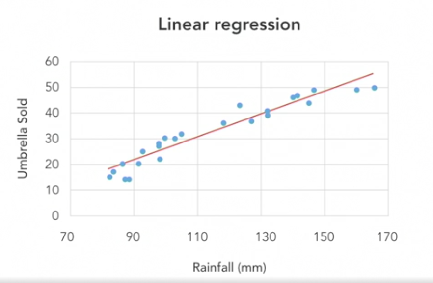
  * Logistic regression is a form of regression where the target variable is binary.
  * Linear regression cant work too well if the target variable can be only within 0 and 1.
  * 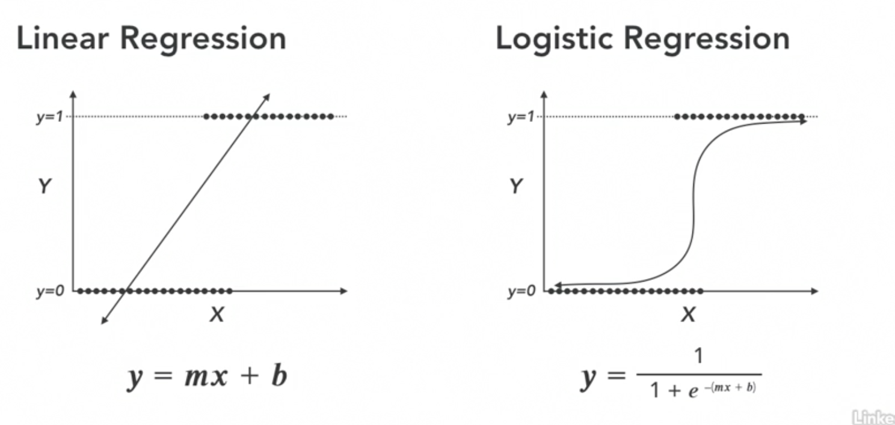

| When to use                                                           | When not to use                                                                  |
| --------------------------------------------------------------------- | -------------------------------------------------------------------------------- |
| Binary target variable                                                | Continuous target variables                                                      |
| Transparency is important or interested in significance of predictors | Massive data (rows or columns) and not for short and fat or skinny and tall data |
| Fairly well behaved data                                              | Unwieldy data (missing, too many outliers or complex relationships)              |
| Need a quick initial benchmark                                        | Performance is the only thing that matters                                       |

* ## Hyper parameters to consider

  * We don't always use all of the hyper parameters available in an algorithm, we use the ones which will have the largest impact.
  * Here we'll only focus on the value of C. C is a regularization parameter that controls how closely the model fits the training data.
  * Regularization is a technique used to reduce overfitting by discouraging overly complex models in some way.
  * C is proportional to reverse of regularization, which means higher the C value, lower the regularization, higher the complexity which can lead to an overfit model.
  * And lower the C value, higher the regularization which can lead to an underfit model.
  * 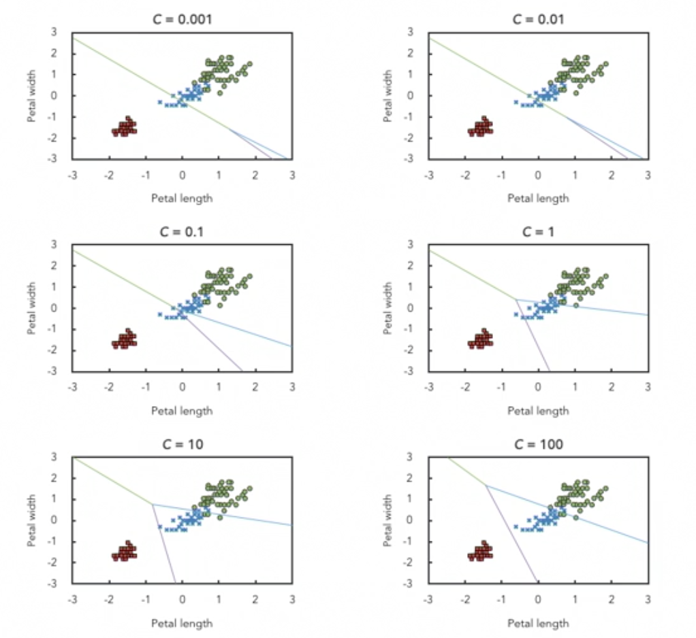

## Support Vector Machine

* ### What is SVM

  * A classifier that finds an optimal hyperplane that maximizes the margin between two classes.
  * 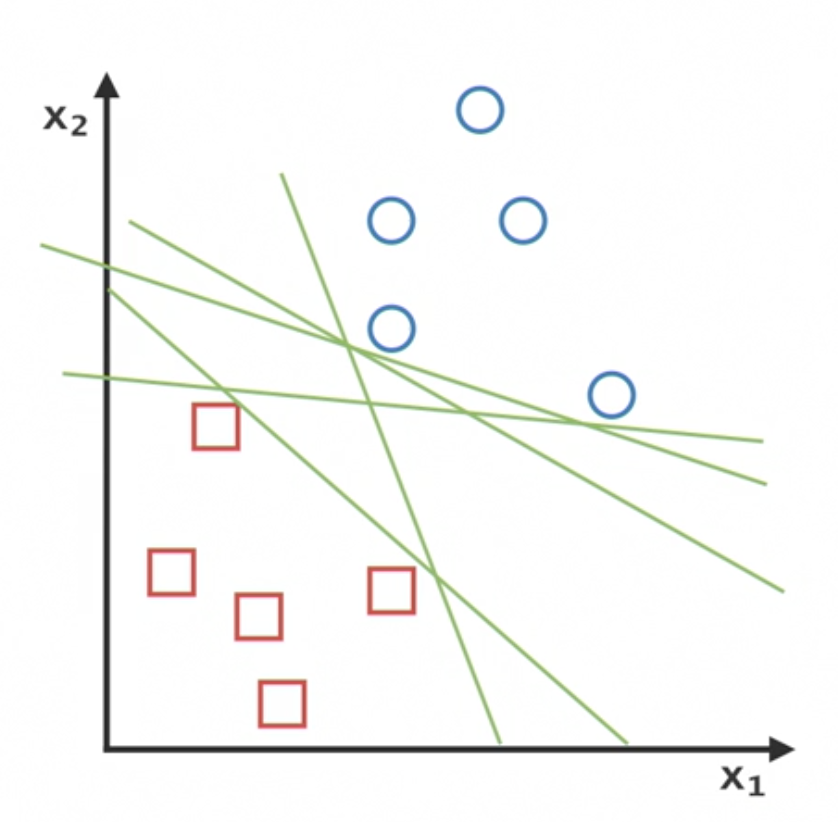
  * All lines in the above image separate the red squares from the blue circles, but we want to find the optimal line. A line which will give us the best chance to correctly classify if we were given new (unknown) cases.
  * 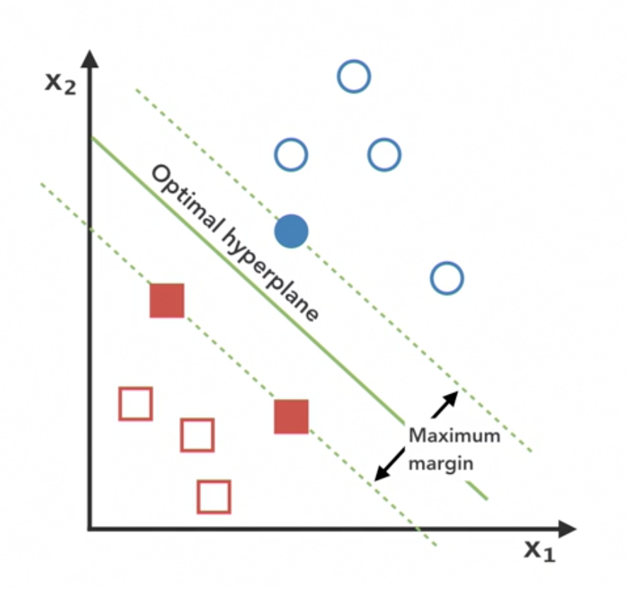
  * Support vector is the perpendicular line between the filled blue circles and the filled red squares.
  * In 2D, the hyperplane is a line, in 3D it's a plane.
  * 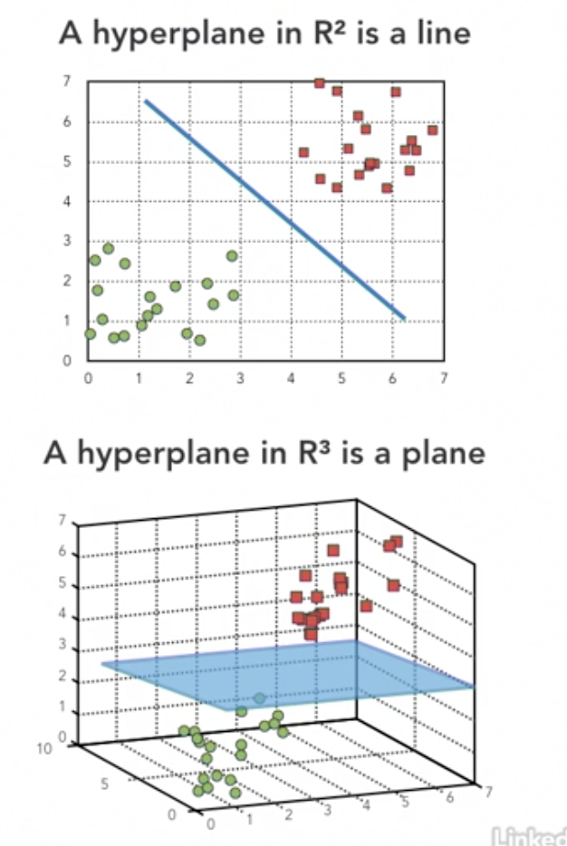
  * The **Kernel Trick (or kernel method)** transforms data that is not linearly separable in n-dimensional space to a higher dimension where it is linearly separable.
  * 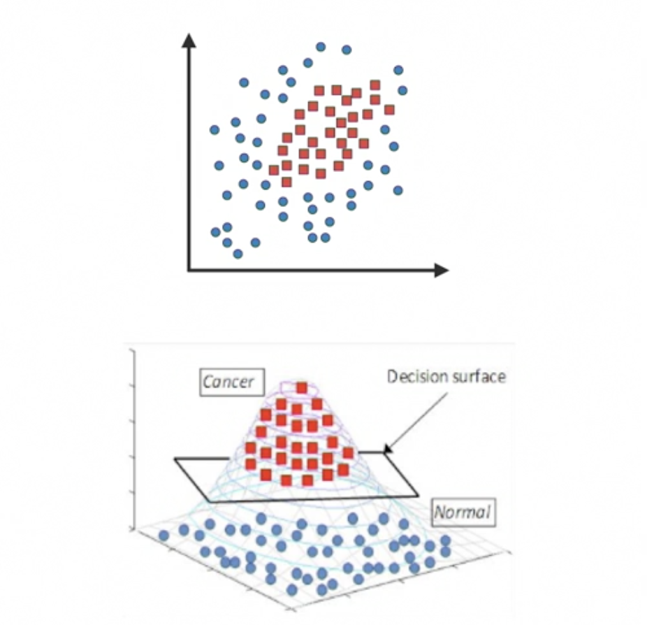
  * If we look at the 2D image at the top, there's no line that can separate out the 2 categories, however, if we convert it to 3D like the figure below, a simple plane will do the trick.

| When to use                                            | When not to use                                                       |
| ------------------------------------------------------ | --------------------------------------------------------------------- |
| Binary target variable                                 | Feature-to-row ratio is very low                                      |
| Feature-to-row ratio is very high (short and fat data) | Transparency is important or interested in significance of predictors |
| Very complex relationships                             | Looking for a quick benchmark model                                   |
| Lots of outliers                                       |

* ### Hyper parameters to consider in SVM

  * We'll focus on C and kernel in our usecase.
  * C here is a penalty term that determines how closely the model fits to the training set.
  * A large value of C means a large penalty for misclassification in training dataset which leads to a small margin and the model will become an overfit.
  * A smaller value will allow the model to misclassify a few points if it leads to a better understanding of the underlying patterns.
  * 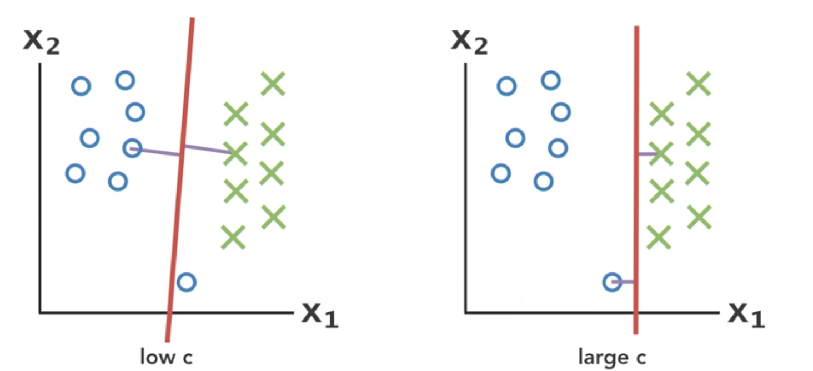

## Multi-layer Perceptron

* ### What is multi-layer perceptron

  * A classic feed-forward artificial neural network, the core component of deep learning.
  * Alternatively, it's a connected series of nodes (in the form of a directed acyclic graph) where each node represents a function or a model.
  * 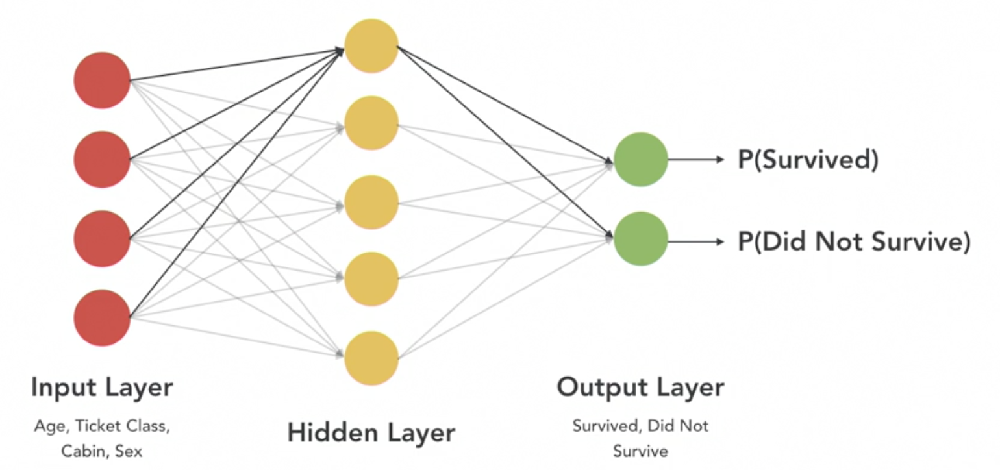

| When to use                                                               | When not to use                                                        |
| ------------------------------------------------------------------------- | ---------------------------------------------------------------------- |
| Categorical or continuous target variables                                | Image recognition, time series.                                        |
| Very complex relationships or performance is the only thing that matters. | Transparency is important or interested in significance of predictors. |
| When control over the training process is very important                  | Need a quick benchmark model.                                          |
|                                                                           | Limited data available.                                                |

* ## Hyper parameters to consider in Multilayer Perceptron

  * We'll only work with the following params:
    * **Hidden layer-size**
      * How many hidden layers there are and how many nodes in each layer.
      * As you add more layers and nodes, you could be overfitting and the model will take longer to run.
    * **Activation Function**
      * Dictates the type of nonlinearity that is introduced to the model.
      * 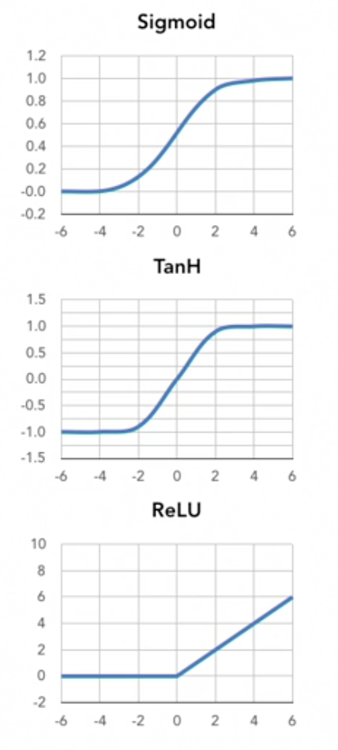
    * **Learning Rate**
      * Facilitates how quickly and whether or not the algorithm will find the optimal solution.
      * 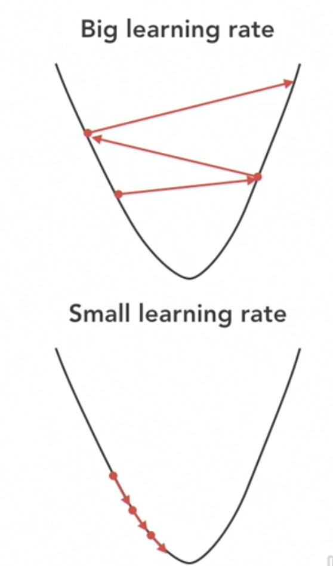
      * With a huge learning rate, it will learn fast but may not find a good solution, with a smaller rate, it will find the solution but will take a lot of time to run. We want there to be a balance between speed and finding the solution.
      * Another reason to tune the learning speed is that in real scenarios, there are a lot of peaks and valleys in the curve, if the learning rate is too low, it may get stuck in a local minim/maxima and never find the optimal solution.
      * There is an initial learning rate already present in the model, we just select how it changes throughout the optimization process.

## Random Forest

* ### What is Random Forest

  * Merges a collection of **independent decision trees** to get more accurate and stable prediction.
  * Ensemble methods combine several machine learning models in order to decrease both bias and variance.
  * The algorithm takes n samples from the training data (with replacement).
  * It takes the sample of features to be used and uses some of those in different trees. Essentially takes a subset of the rows and the columns of the dataset per tree.
  * Then it builds an optimal decision tree for each subset independently.
  * 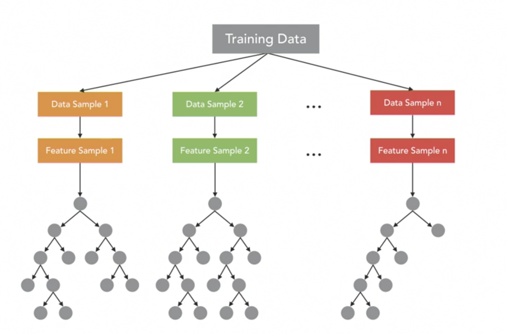
  * In case of test data, it will aggregate and make the final prediction using the results of the n tees. In our case it'll use voting and the one with the highest count wins.
  * 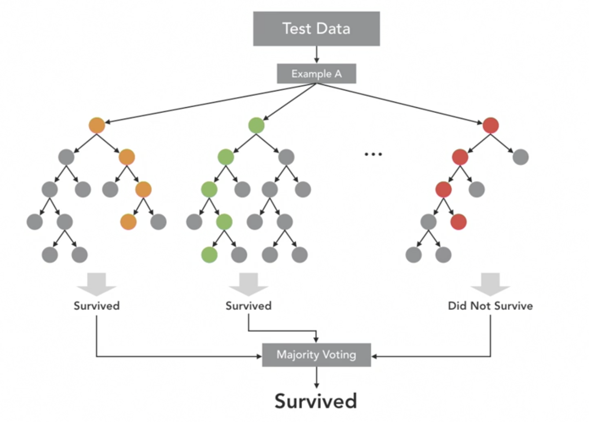

| When to use                                                | When not to use                                                                                                                                                           |
| ---------------------------------------------------------- | ------------------------------------------------------------------------------------------------------------------------------------------------------------------------- |
| Categorical or continuous target variables                 | If you're solving a very complex, novel problem. Maybe be good for a usecase to build something 90% of the way but if you want an optimal model, RF is not the way to go. |
| Interested in significance of predictors                   | Transparent is important                                                                                                                                                  |
| Need a quick benchmark model                               | Prediction time is important                                                                                                                                              |
| If you have messy data such as missing values and outliers |

* ### Hyper-parameters for Random Forests

  * We'll focus on the following hyper parameters:
    * **n_estimators**
      * The number of independent decision trees to be built for the model.
      * In a way controls the width of the model.
    * **max_depth**
      * How deep the trees can be.
      * Controls the depth of the model so to say.

## Boosting

* ### What is Boosting

  * Aggregates a number of weaker models to build one strong model.
  * A weak model is one that is only slightly better than random guessing.
  * A strong model is one that is strongly correlated with the true classification.
  * Boosting effectively learns from its mistakes with each iteration.
  * Boosting has multiple sub-types, we'll be looking at gradient boosting here.
  * We'll take a data sample and build a simple tree (weaker model).
  * Post evaluation, the misclassified examples are given extra weight and builds a new weak model.
  * And the process is repeated multiple times and a final strong model is the resultant of the process.
  * 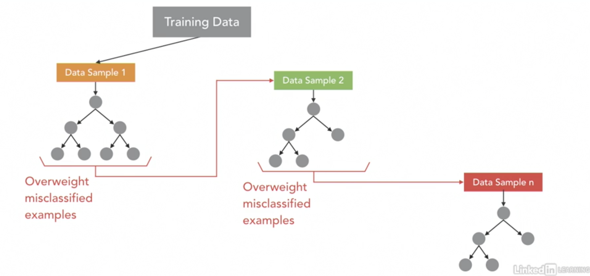
  * In contrast to Random Forest, the models are run one-by-one, so the training process is much slower. However, the predictions are much faster, since we already have the model in place.
  * 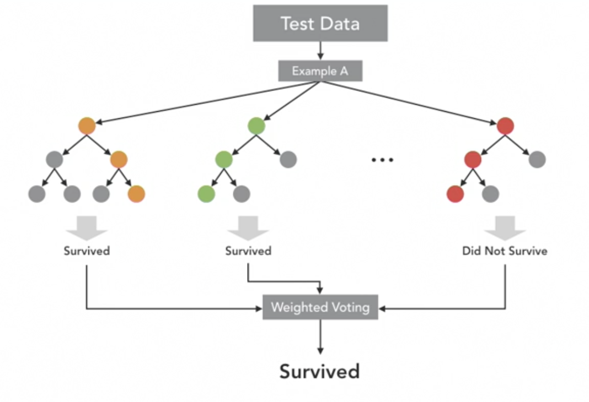

| When to use                                 | When not to use                                                                               |
| ------------------------------------------- | --------------------------------------------------------------------------------------------- |
| Categorical and continuous target variables | Transparency is important                                                                     |
| Useful on nearly any type of problem        | Training is important or compute power is limited                                             |
| Interested in significance of predictors    | Data is really noisy, then is should be avoided, since it will try to fit to the missing data |
| Prediction time is important                |

* ### Hyper Parameters to consider

  * We'll work on the following hyper parameters
    * n_estimator
    * max_depth
    * learning_rate
      * Here the learning rate controls the value of the learning rate instead of the constant values in MLP.
    * The trees for GB should be lower than that of Random Forests.

## Summary

* ### Why so many models

  * **No Free Lunch** theorem: No algorithm works best for every problem.
  * What to compare upon?
    * Accuracy:
      * How does the algorithms handle the data of different sizes?
        * Short and fat
        * Long and skinny.
      * How does it handle the complexity of feature relationships?
      * How does it handle messy data?
    * Latency: 
      * How long will the model take to train?
        * Logistic is fast to train, but XgBoost and SVM are slow.
      * How long will it take to predict.
        * XGBoost is really fast to predict.

* ### Conceptual Comparison

  * 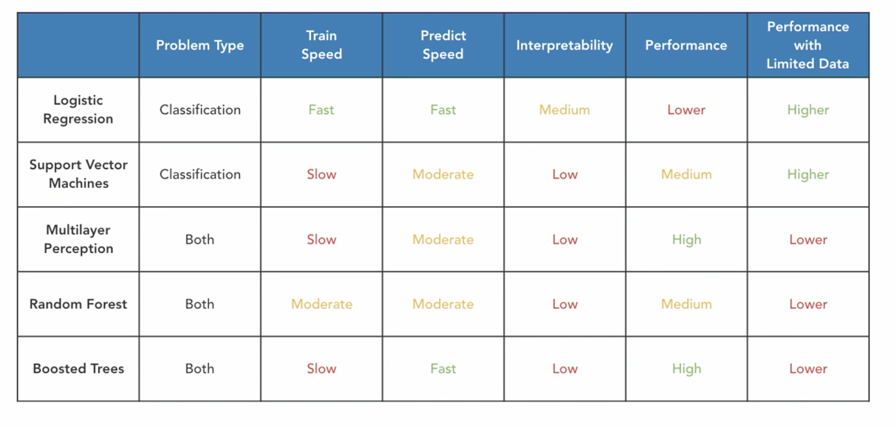
  * Train Speed: LR -> RF -> MLP, BT -> SVM
  * Predict Speed: BT, LR -> MLP, RF, SVM
  * Interpretability: LR -> BT, RF (feature importance attribute) -> MLP, SVM
  * Performance: BT (flexible, typically performs well on almost all problems) -> MLP -> RF, SVM -> LR
  * Performance with Limited Data: SVM -> LR -> RF, BT -> MLP

* ### Final Model Selection

  * Evaluate all of our saved models on the validation set
  * Select the best model based on performance on the validation set
  * Evaluate that model on the holdout test set

* fast.ai
