# Applied Machine Learning: Foundations

## Machine Learning Basics

* ### The kind of problems can ML help solve

  * Does the problem require a prediction or bucketing something into categories?
  * Is the problem relatively sef-contained i.e. the problem should not depend too heavily on too many external factors.
  * Do I have data with labels?
  * Do I have the ability to assess the quality of the model.
  * Can I determine an acceptable accuracy threshold, we have to be able to tie the performance and cost of the model to earning or savings of some sort. Or, do we understand the business impact of the model, what is the break even point and what would be considered success.
  * 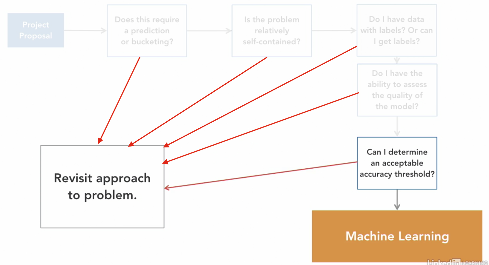
  * Some examples for ML usecases are:
    * Spam detection
    * Speech recognition
    * Recommendations
    * Fraud detection

* ### Why Python

  * Some popular python packages:
    * Machine Learning:
      * scikit
      * learn
      * LightGBM
      * SciPy
    * Deep learning:
      * TensorFlow
      * PyTorch
      * keras
    * Text
      * NLTK
      * genism
    * Images
      * OpenCV
      * scikit-learn
    * Visualization
      * Matplotlib
      * Seaborn
    * Data analysis
      * pandas
      * NumPy

* ### Disambiguation of the terms

  * 
  * **Machine learning** can be thought of as pattern matching at it's simplest.
  * **Deep learning** a subset of machine learning, you'll just have many functions connected with each other to predict or connected pattern matching.
  * **Artificial intelligence** is a superset of machine learning. Has 2 types, Weak AI and Strong/general AI.
  * 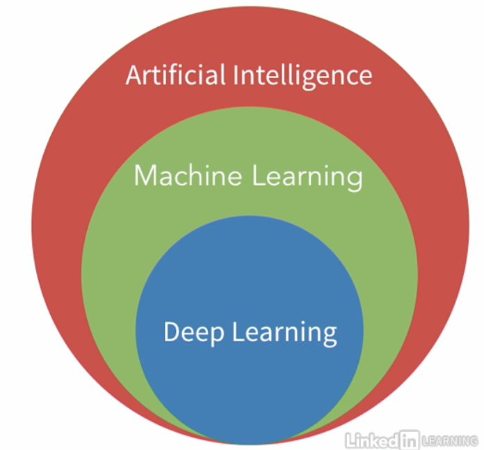

* ### Common challenges

  * Problem scoping:
    * The right problem isn't solved.
    * Tolerance threshold is undetermined.
    * Impact in real environment can't be measured.
  * Data:
    * Lack of data/data sensitivity.
    * Too much data.
    * Data without labels.
    * Data is too biased, dirty, noise, incomplete etc.
  * Infrastructure
    * Lack skills to robustly automate. A fraud detection model should run for every transaction, which has to be automated and fast, easier said than done.
    * Not enough computation power.
    * Inability to A/B test with existing solution.
    * Inability to continuously track model quality.
  * Latency
    * Model takes too long to train.
    * Model takes too long at inference time (a deployed model takes too long to respond).

## Exploratory Data Analysis and Data Cleaning

* ### Explanation

  * Why EDA?
    * Understand the shape of the data.
    * Learn which features might be useful
    * Plan for the cleaning that will come next.
  * What is EDA?
    * Counts or distributions of all variables.
    * Data types for features/variables both input and output.
    * Missing data
    * Correlations
    * Duplicates
  * Why data cleaning?
    * Shape data to that the model can pick up on the signal
    * Remove irrelevant data
    * Adjust features to acceptable for a model.
  * What is data cleaning?
    * Anonymise
    * Encoding categorical variables
    * Fill missing data if necessary
    * Prune/scale data to account for skewed data/outliers

* ### Exploring continuous features

  * On taking the mean, we can see that the average fare for the people who survived is more than double of the people that didn't. Moreover, the mean of Pclass also points to the fact that more people from higher class survived.
  * describe method also tells us that the only continuous feature with missing values is **Age**. Now to manage that, we need to look at the datapoints with the missing values to deduce if for example it's been missed randomly or just that the age for a certain class or category was not asked for.
  * To analyse the datapoints with missing age, we group by null age values and we see that, the survival rate for people with missing date is lower, they have fewer parents and children onboard and their average fare is also lower as compared to the rest of the group. But none of this leads to a relevant conclusion about a specific group having missing values.

* ### Plotting continuous features

  * The histogram for age doesn't conclude much.
  * On looking at the averages, we found that the average fare for people that survived was way higher at 48 as compared to the averages for people who didn't at 22. But the plot clarifies, that the likelihood of surviving and not surviving is also the same after the first 2 bars.
  * So fare can be a good indicator, but not as great as the averages sold it to be.
  * Looking at the category plot of Pclass, we can see that people from 1st class are more likely to survive than from that from 2nd class and further form the 3rd class.
  * The plots for Parch and SibSp show that people with more parents, children, siblings and spouse are much less likely to survive than the others. Maybe we can merge those into a single feature.

* ### Cleaning continuous features

  * Since we had concluded that passengerId does not contribute into a person's survival, we'll drop that feature.
  * Also, after grouping by the missing age value, we found that there was no real correlation between age and other variables, so we'll swap out the missing age values with the mean of all ages.

* ### Explore categorical features

  * On exploring the missing data for the column **Cabin**, we see that the survival rate for the rows with missing values is only ~30% whereas the same for the ones having the value is ~67%, this points that there is a strong correlation between Cabin and Survival.
  * In general, when there's 80% missing data for a column, we'd just drop it, but in this case, there is a strong correlation between missing cabin number and survival, so this is an important and strong variable.
  * So we'll just convert the cabin values into a variable that says whether the person had a cabin or not.

* ### Plotting categorical variables

  * The plot for **sex** shows that around 70% of the females survived.
  * Even the plot for **embarked** shows some clear distinction in the survival rates, but we can see that the error rates are quite high for all 3 values, moreover, it makes no practical sense that the embarkation point had anything to do with survival. Maybe just a higher number of females boarded from C.
  * We create a pivot table *for the count of* **Survived** while looking at **Embarked and Sex**.
  * We can see that the number of males at S was almost double the number of females there, so the low survival rate makes sense. However, the ratio at C and Q is similar. So we can conclude that the relation for S can be explained by sex.
  * We'll now look at a pivot table with **cabin**. The table shows that the percentage of people with or without cabin at C was almost 50-50, whereas the same for the other 2 is highly skewed and that the number of people without cabin is much higher. This does explain the survival difference between C vs S and Q.

* ### Categorical data cleaning

  * Based on the analysis done above, we'll drop name, ticket and embarked.
  * Convert cabin to a boolean showing whether cabin value is present or not.
  * Convert sex to an int, male = 0, female = 1.

## Measuring Success

* ### Why do we split up our data

  * 
  * We split the dataset into training, validate and test.
  * We use training set to train models and then use the validation set to validate the models and come up with the best option.
  * Then we finally run the selected model on the test partition, if it doesn't perform as expected, we try and introduce new variables to tackle the situation at hand.

* ### Cross-validation

  * **Holdout test set:** Sample of data which wasn't used to fit the models.
  * **K-Fold Cross Validation:** the dataset is divided into k subsets and the holdout method is run k times, using 1 of the k sets as test and a combination of the remaining k-1 sets as training data.
  * 
  * Being able to validate the model's performance on 5 different variations of the test set gives us a better picture of how the model might perform on real data.

* ### Evaluation Framework

  * Any evaluation framework has 2 components:
  * **Evaluation metrics:** how are we estimating the accuracy of them model?
    * 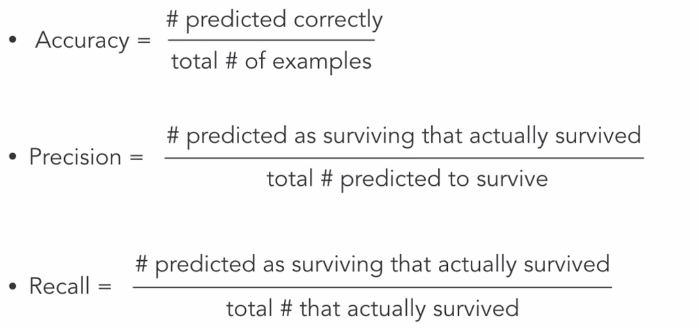
    * 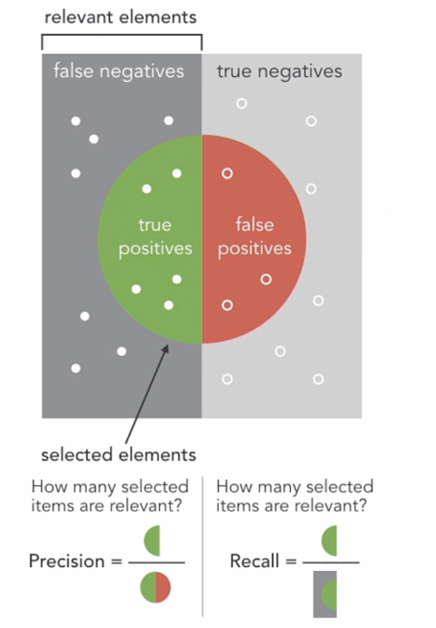
  * **Process:** how do we leverage our dataset to mitigate the likelihood of overfitting or underfitting.
    * Run fivefold cross-validation and select the best models with the relevant evaluation metrics.
    * Re-fit the models on the full training set, evaluate them on validation set and pick the best one.
    * Evaluate the best model on test set to gauge its ability to generalize to unseen data.

## Optimizing a model

* ### Bias/Variance Trade-Off

  * 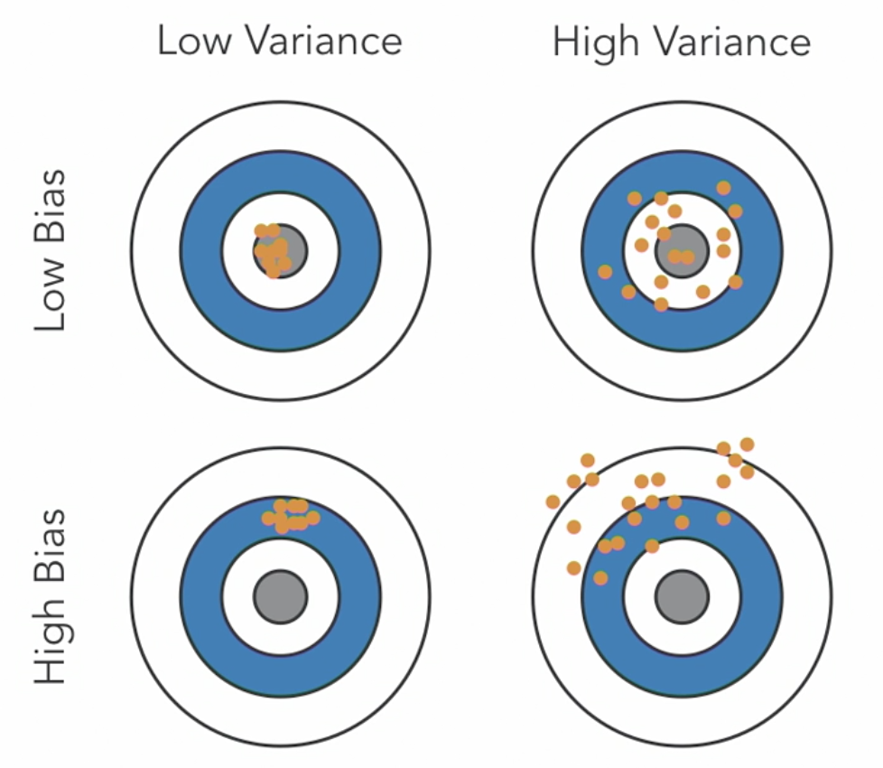
  * Bias is an algorithm's tendency to consistently learn the wrong thing by not taking into account all of the info in the data.
  * High bias is the result of an algorithm missing relevant relationships between the input variables and the target output.
  * Variance refers to an algorithm's sensitivity to small fluctuations in the training data set.
  * High variance is the result of an algorithm fitting to random noise in the training data.
  * 
  * Total Error = (Bias + Variance) + Irreducible Error

* ### Underfitting

  * 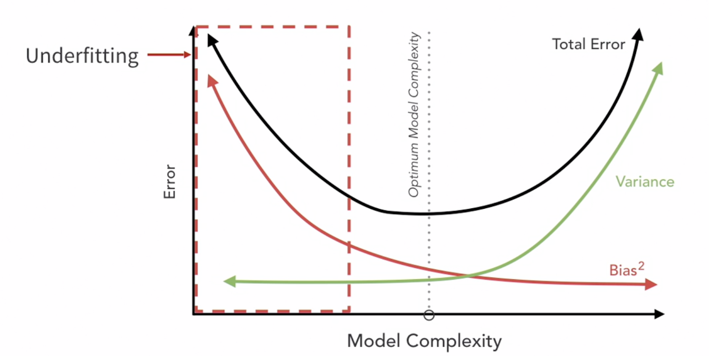
  * When an algorithm cannot capture the underlying patterns of the data.
  * 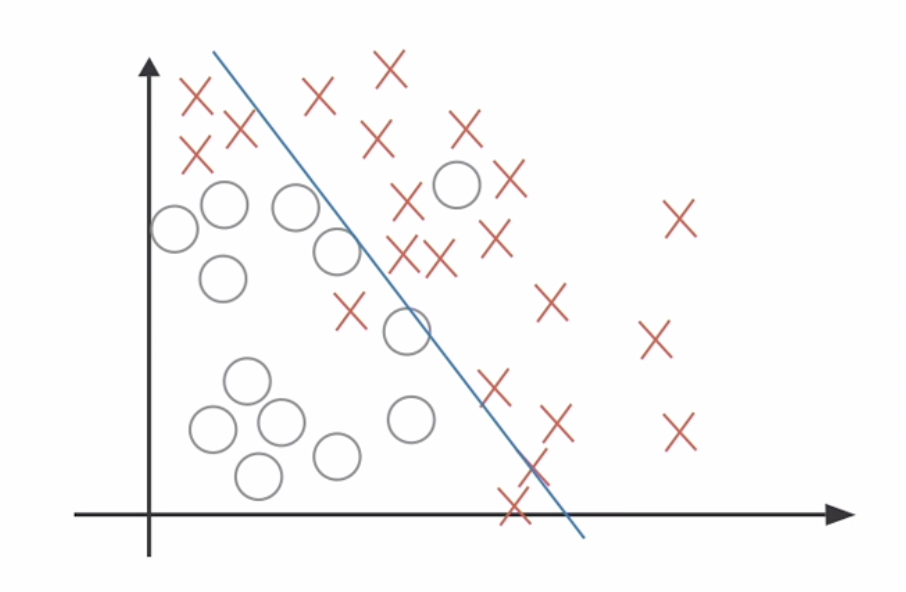

* ### Overfitting

  * 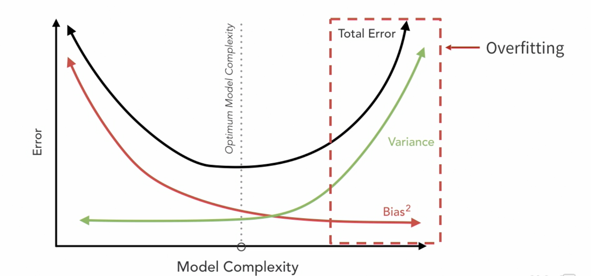
  * When an algorithm fits too closely to a limited set of data.
  * 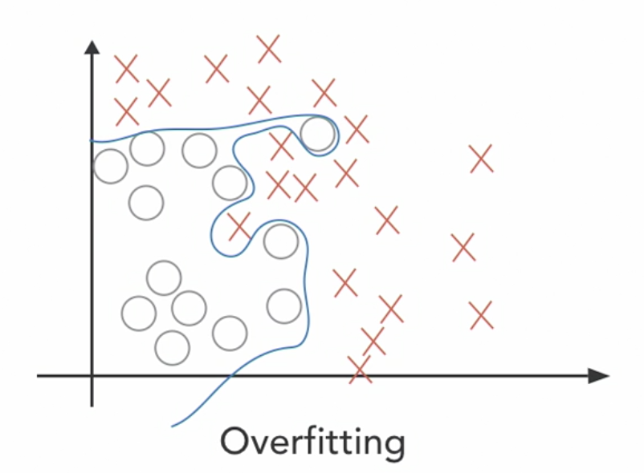

* ### Finding the optimal tradeoff

  * 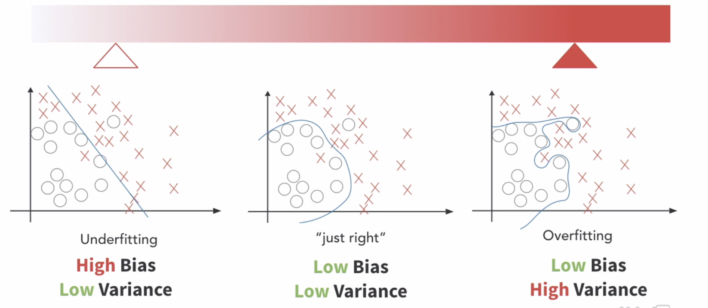
  * 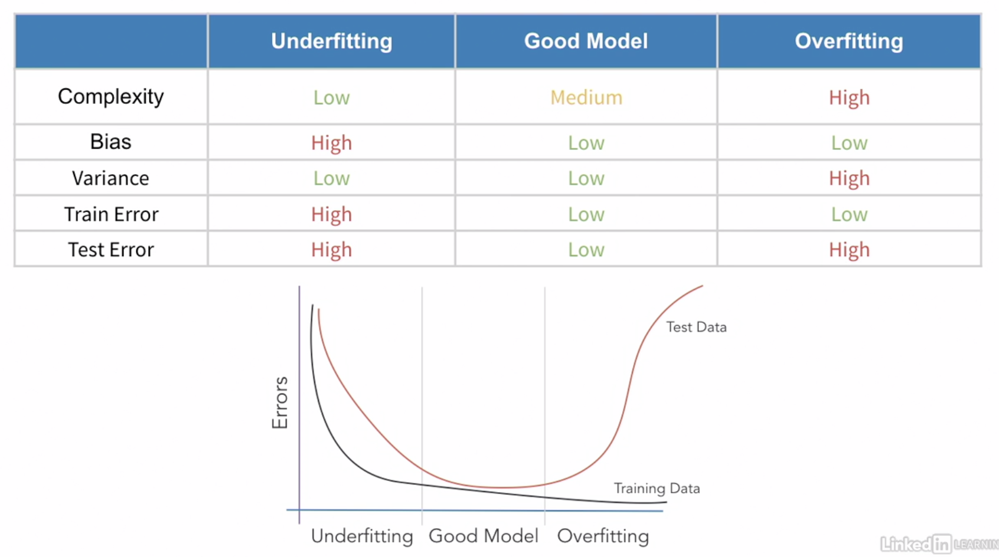

* ### Hyper parameter tuning

  * A model **parameter** is a config variable that is internal to the model and its value can be estimated from the data.
  * A hyper-parameter is a config that is external to the model and it can not be estimated from the data, but it guides how the algorithm learns parameter values from the data.
  * For example, in a decision tree, the age param on which some some leaves are created, is a parameter, eg. fare > 22. The hyper parameter in this case would be the depth of the tree or the input variables to consider.
  * 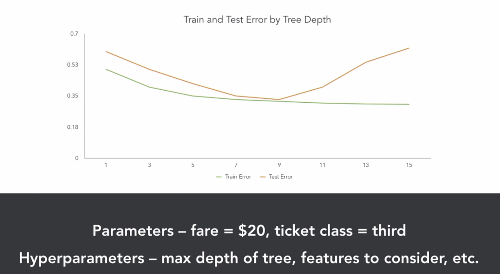

* ### Regularization

  * Techniques used to reduce overfitting by discouraging overly complex models in some way.
  * The goal is to allow enough flexibility for the algorithm to learn the underlying patterns in the data but provide guardrails so it doesn't overfit.
  * ***Occam's razor**: whenever possible, choose the simplest answer to a problem. In our case, it means that we should select the simplest model which is accurate enough.
  * **Ridge and lasso regression**: adding a penalty to the loss function to constrain coefficients i.e. the model's accuracy will have to significantly for it to become more complex.
  * **Dropout:** some nodes are ignored during training, which forces some other nodes to take on more or less responsibility for the input/output.

## End-to-end pipeline

* .
