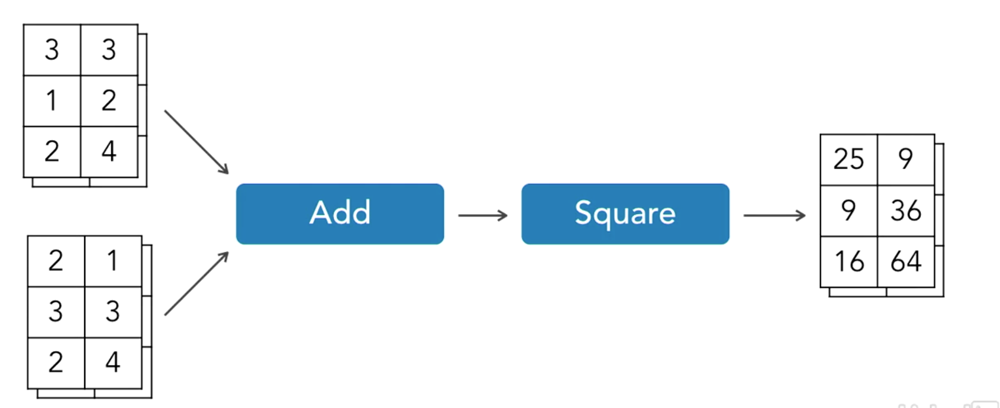
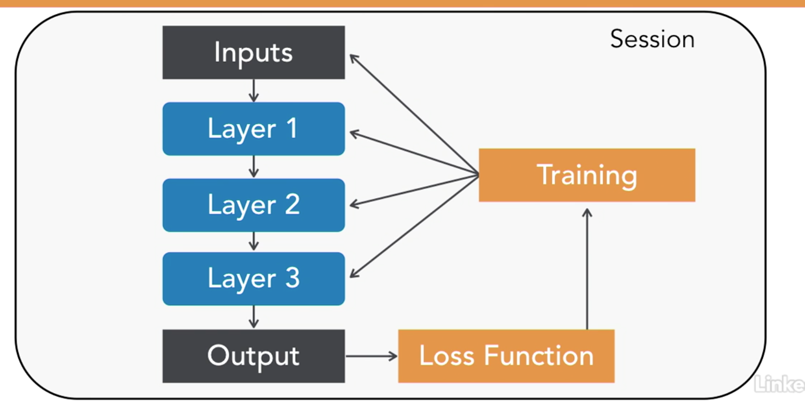

# TenserFlow

## TenserFlow Overview

* Used for:
  * Image recognition
  * Speech recognition
  * Image style transfer
  * Language translation
* We'll use it to predict the sales of a new video game based on the similar games in the past.
* It's called called TenserFlow because data (tensors) flows through the system.
* 
* Can be used to model almost any series of calculations.
* Typically used to build deep neural networks

  | Pros                      | Cons                                        |
  | ------------------------- | ------------------------------------------- |
  | Powerful and flexible     | Steep-learning curve                        |
  | Can build almost anything | Very little is done for the user by default |

* Requirements
  * Development phase: when we're coding and training a neural network
    * Computers running Windows, macOS, Linux
    * Can use multiple Linux machines (locally or in the cloud) for very large projects
  * Runtime (or inference) phase: when we're making predictions with a trained neural network.
    * Computers running Windows, macOS or Linux
    * Linux servers running TensorFlow Serving.
    * Google's Cloud Machine Learning Engine service
    * iOS or Andrioid mobile devices.
* GPU Acceleration
  * TensorFlow can take advantage of NVIDIA-brand GPUs.
  * GPUs (NVIDIA only) can greatly decrease neural network training times for large neural networks
  * Using a GPU with TensorFlow requires additional software form NVIDIA (CUDA and cuDNN)
* Programming language support
  * The core execution engine is written in C++ for speed.
  * Python is the best supported and easiest language to use.

* ### The train/test/evaluation flow in TensorFlow

  * 
  * Build a model as a graph
  * We can start at any node.
  * The operations in a TensorFlow model run in a session
  * Once the session is created, we can run any operation in the graph.
  * In every iteration of training we pass in new input data and measure the accuracy using the loss function.
  * While the training process is running we can watch the results in TensorBoard.
  * After running the testing phase, we save the model if we're happy with the results.
  * On saving the model, we're writing out the flow and the state of every node in the graph.
  * While we make predictions on new data, we don't need the loss function and the training nodes, so we can remove those before deploying the model.

## Resources

* Theano <http://deeplearning.net/software/theano/>
* Torch <http://torch.ch/>
* PyTorch <http://pytorch.org/>
* Keras
* Amazon Rekognition API
* Microsoft Azure Face API
* OpenFace
* dlib
