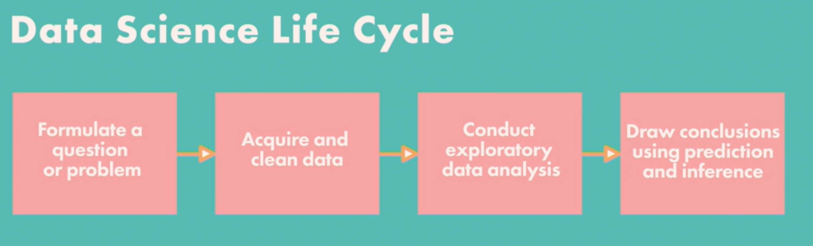

# Introduction to Data Science

* ## *Differences between different disciplines in a Data Science Team*
    Data Scientists  | Data Engineers
    -- | --
    Optimize data processing | Optimize data flow
    Define metrics| -
    Establish collection methods| -
    Work with enterprise systems| -
    ----------

    Data Scientists | Statisticians
    -- | --
    Large scale data collection | Polls
    Data cleaning | Surveys
    - | Experiments
    Create machine learning models | Improve upon a simpler model
    Implement Algorithms | -
    ----

    Data Scientists | Business Analysts
    -- | --
    -- | Data base design
    -- | ROI assessment
    -- | Finance planning
    -- | Optimization
    -- | Risk management
    ----

* ## *Differences between different disciplines in a Data Science Team*
    * Customer service
    * Navigation
    * Recommendations
    * Voice-to-text
    * Image processing
    * Fraud detection
    * Robotics
    * Impacted industries
        * Healthcare
        * Save rare species
----
* ## *Data Science Life Cycle*
    
----
* ## *Data Design*
    * The process of data collection
    * Probability sampling
        * Assigning precise probabilities to each data sample to reduce bias in data design
        * Types of probability sampling
        * **Simple random sampling (SRS):**
            Sampling at random without replacement. Ex. To apply SRS to number 0-9, put them in a hat and pull number at random to have random number having up-to 10 digits

        * **Cluster Sampling:**
            Divide data into clusters and use SRS to select clusters. Ex. To take a cluster sample of 2 people from a population of 8, make 4 pairs of 2 and pull one randomly. Sample size = 2.
             Pros | Cons
            -- | -- 
            Easy Sample Collection | Produces variation
            Used to conduct surveys | Requires large samples

        * **Stratified Sampling:**
            Divide data into strata and produce a simple random sample per stratum. The strata don't have to be the same size.
            For example, you can create strata by job, this way no single job gets left just because the number of people is low.
            You pick 1 person each from every strata using SRS to gets the sample.
----
* ## **Computational Tools**

    Python | R
    -- | --
    Data analysis needs to be integrated in web applications | Data analysis using Standalone computing on individual servers.
    Statistics code in prod DB | --
    Productivity | Better and user friendly data analysis
    Code Readability | Statistics
    Used by programmers for data analysis or statistics | Used mostly in academics and research
    Easy-to-use syntax | More-complex syntax
    Easy to learn | Steep learning curve
    Python Package Index (PyPi): a Python software repo consisting of various for use | Comprehensive R Archive Network (CRAN): An R package repository
----
* ## **Tabular Data**
    ### **Pandas**:
    * A python library for data manipulation and analysis.
    * Find the 5 most popular baby names in the US in 2014.
        * Slice out the rows for 2014
        * Sort rows in desc order of count
        * Get the first 5 rows.
    * What were the five most popular baby names in 2014 in the state of California
        1. Rows for 2014
        2. Rows for California
        3. Sort in desc order
        4. Take the first 5
    * What were most popular female and male baby names each year
        * Rows for California
        * Group by year and gender
        * Compute the most popular names
    * How frequently does your name occur across the years in the US among baby names and plot it in a horizontal bar-plot
        * Rows with my name

----
* ## **Exploratory Data Analysis**
    * An approach to analyzing data sets to summarize their main characteristic 
    * Conducting EDA
        * Avoid making assumptions
        * Examine data types
        * Examine key properties
    * Data Types
        * Nominal data: data with no inherent order
            * Political party affiliation
            * OS affiliation
            * Gender
            * Languages spoken
        * Ordinal data: data with ordered categories
            * Clothing size: S, M L, XL
            * Level of education: high-school, UG, PG
            * Yelp rating: 0-5 stars
        * Numerical data: data that consists of amount or quantities
            * Height
            * Weight
            * Price
            * Distance
            * Blood Pressure
    * The **type of data** you have determines **what you can do** with it
        * Consider a table like this: education -> 1=Junior-High, 2=High-school, 3=UG, 4=PG, 5=Ph.D.
            ID | Job Title | Salary | Education
            -- | -- | -- | -- |
            1 | CEO | 1,000,000 | 5
        * ID and Job is nominal data, salary is numerical data and education is ordinal data
        * To calculate the mean of salaries, you just take the average and that'll be that.
        * But if you do the same for Education, you may get 2.7, which makes no sense.
    * ### **Properties to look for in the data**
        * Granularity
            * What does each record in your data represent?
            * How fine or coarse is the data?
        * Scope
            * What does the data represent?
            * Does the data cover the topic we're interested in?
        * Temporality
            * When was the data collected?
        * Faithfulness
            * How accurately does the data describe the real world?
            * Should we trust this data?

----
* ## **Data Cleaning**
    * Detecting and fixing corrupt or inaccurate data form a record set.
    * It generally looks to address the following issues with the data:
        * Missing values
        * Formatting of values
        * Structure of the overall data
        * Extracting info form complex values
        * Unit Conversion
        * Interpretation of magnitudes
    * Some examples can be:
        * Missing values
        * Misspellings
        * Inconsistent formats
        * Unspecified units for numerical data
    * Data cleaning questions
        * Are there any missing values in the dataset?
        * Are there missing values that were filled in?
        * Which parts of the data were entered by humans?

----
* ## **Data Visualization**
    * Matpotlib: 2D visualization
    * Seaborn: based on Matpotlib, allows to us to create multidimensional and other advanced visualizations.
    * Different types of charts are used to visualize different types of data.
    * Qualitative data
        * Also known as categorical data
        * 2 Subtypes: nominal and ordinal
        * Bar charts are commonly used to represent qualitative data.
        * Plot a bar-chart showing the count of listings by neighborhood in NYC
        * Plot a bar-chart to show the avg price of listings by neighborhood in NYC
    * Histograms and Scatter Plots are commonly used to visualize quantitative (numerical) data.
        * Plot the prices of Airbnb listings in a histogram
        * Create a scatter plot for prices and number of reviews for listings.

----
* ## **Statistical Inference**
    * The process of using data analysis to deduce properties of an underlying probability distribution
        * Election forecasting
        * Test score predictions
    * Statistical inference methods
        1. Hypothesis tests
        2. Confidence intervals
    * Hypothesis tests are used to make confirmed conclusion based on the data that's being observed.
    * Data collection is not always precise.
    * Hypothesis tests help decide if the data trends being observed are **Random fluctuations or Real phenomena**
    * Null hypothesis:
        * Does not state any associations between variables and usually attributes trends to random chance
        * Chick Growth Null Hypothesis
            * The weight of the chicks with all 4 diets remains the same irrespective of the diet. If they are different, it's due to random chance.
    * Alternative hypothesis
        * Attributes trends observed in the data to association between variables.
        * Chick Growth Alternative Hypothesis
            * The weight growth for chicks with different diets will be different.
    * The goal of a hypothesis test is to decide between the null hypothesis and alternative hypothesis
    * Test statistic helps decide between the 2 hypothesis = difference between the weight statistics in chick with different diets
    * The plots indicate that the alternative hypothesis is followed for lower values but for higher values null hypothesis is followed
    * Permutation test: Randomly permute (arrange) the data.
        * **P value** in general means the probability of observed value shows up in the simulated values of the test statistic, assuming the Null Hyp is true
        * The value here = (number of values from the samples < observed value) / total samples
    * Bootstrapping a confidence interval: to predict an unknown parameter
        * Can simulate new random samples by resampling
        * Resampling consists of sampling at random
        * Each time you resample, you compute an estimate of the unknown
        * Collect all estimates computed along the way.
        * A confidence interval is created using the estimates 
        * The value of the unknown is then said to be within that interval
    
----
* ## **Classification**
    * Process of making categorical predictions using data
    * You have some data in the correct categories
    * You want to learn from this data
    * Uses
        * Weather forecasts
        * Classify emails as spam or not spam
        * If a patent has a disease 
        * Which candidate a person will vote for
        * Genre of a song, movie or TV show
        * On dating sites to find if 2 users are compatible
    * Observation is a situation where you want to make a prediction
        * Attributes are known aspects that describe the observation
        * Observations belong to an unknown class
        * The goal is to correctly predict the classes using attributes
    * Training data
        * Contains observation which have already been classified
        * Analyzing the training data builds a classifier
        * Classifier is an algorithm to classify future observations
    * K nearest neighbor (k-NN)
        * Pick an odd number k
        * Pick a set of attributes of the training data that are most relevant to the classification
        * You now pick k nearest data points which are closest to the new data point
        * The most frequent class among the k-NN is the for the new data point
        * Spam or Not Spam
            * Use training dataset of not spam emails
            * Observe, subject, body, timestamp, was replied or not, was it forwarded
            * Length of subject and body might be relevant for deciding spam
            * Look for patterns/trends in training data.
            * Use k-NN to see if new emails are being classified properly