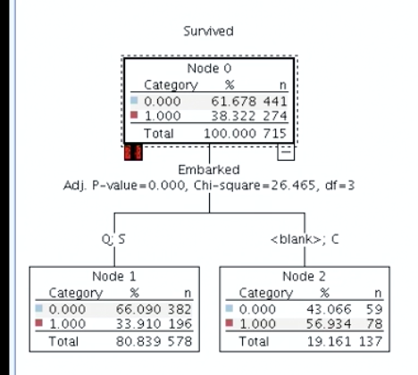
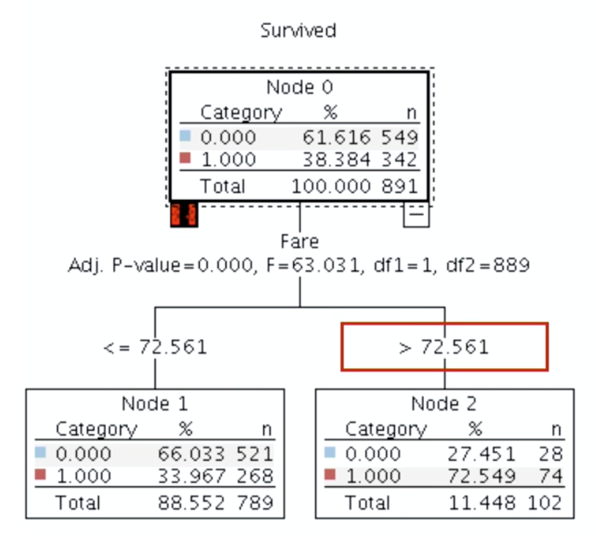
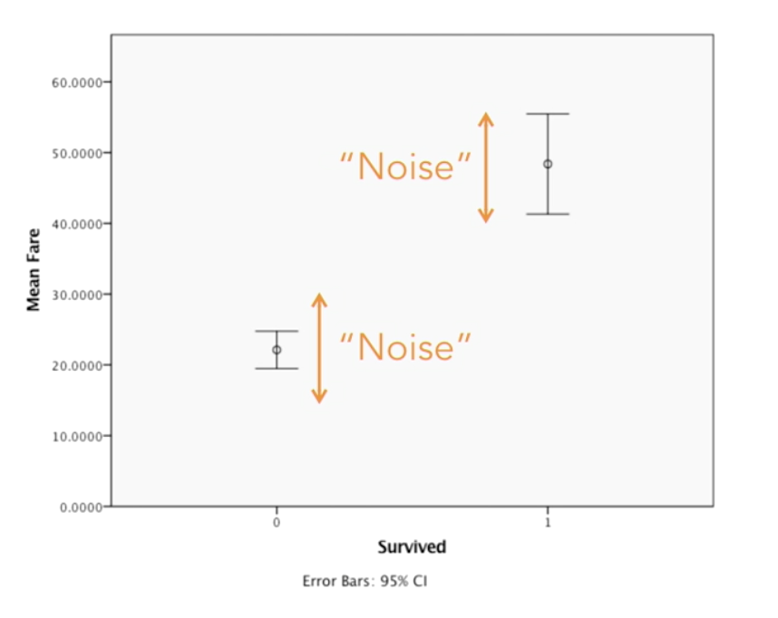
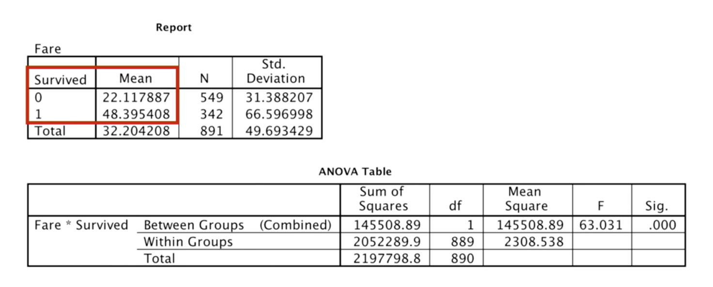
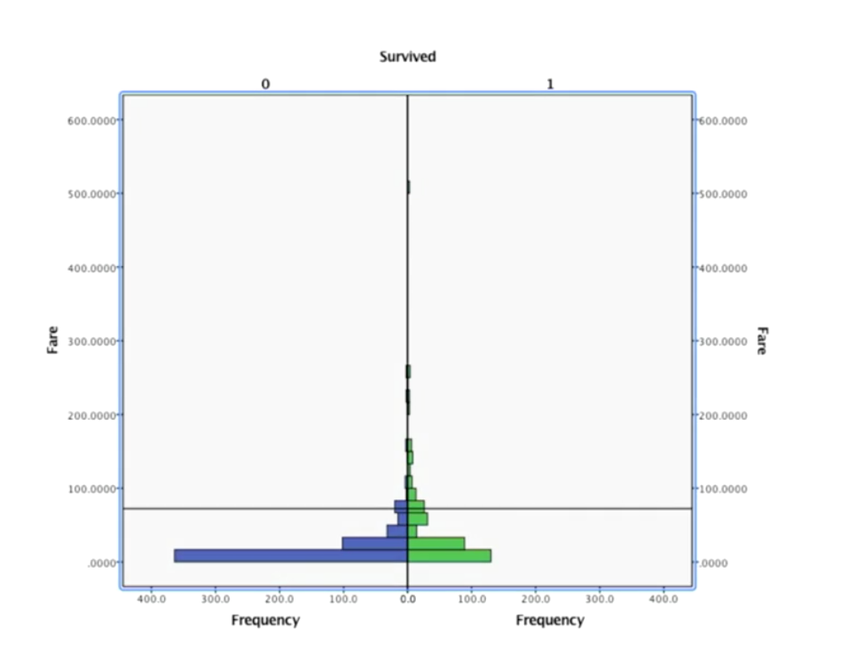
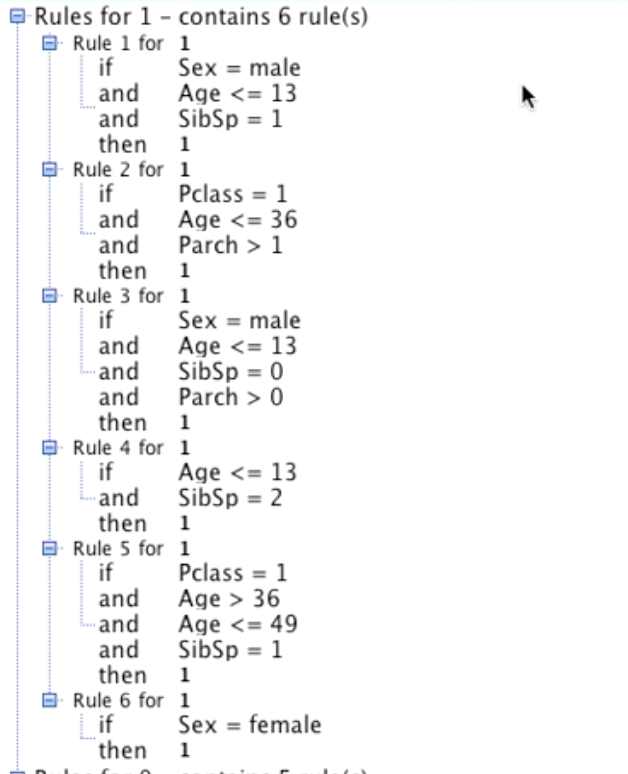
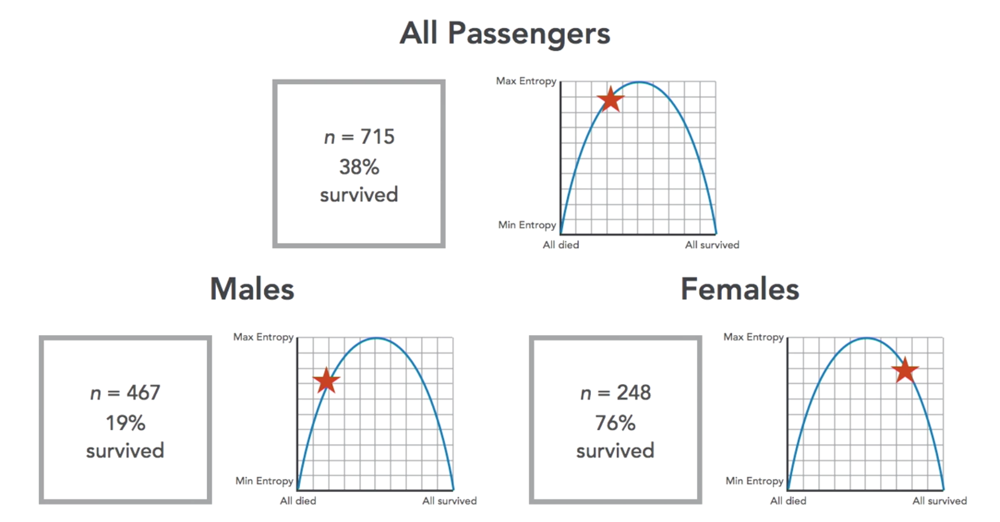
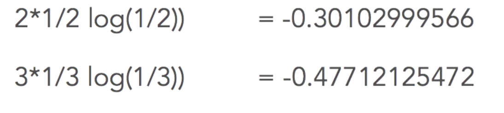
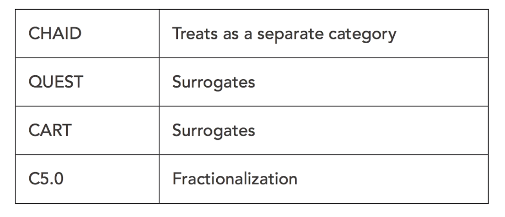
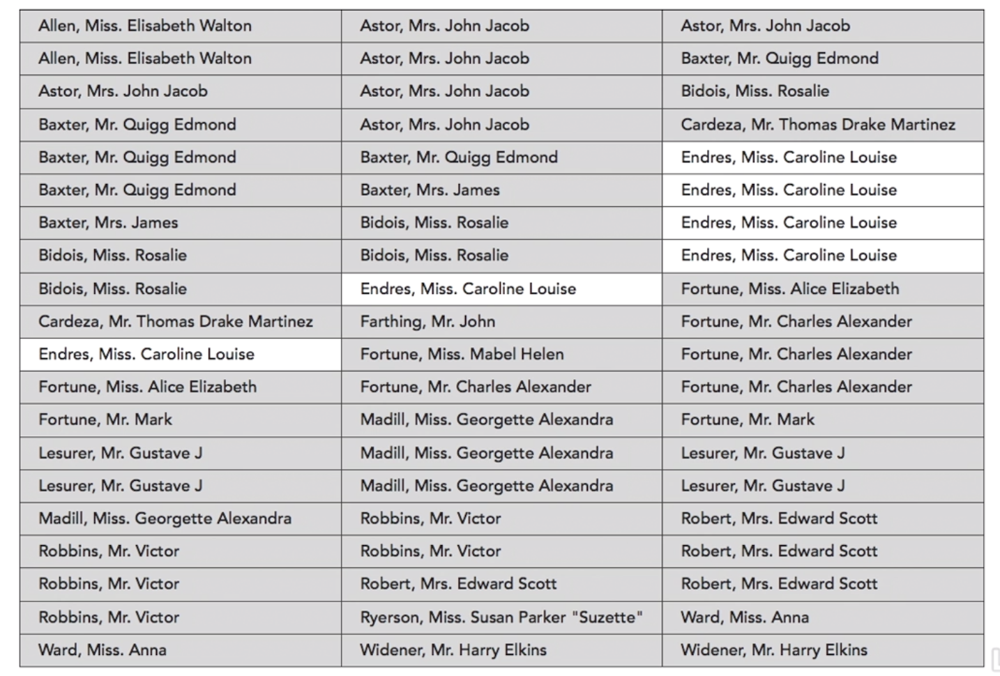

# Advanced Decision Trees

## Understanding QUEST (Quick, Unbiased and Efficient Statistical Tree)

* ### Overview

  * QUEST wast built to improve upon CART AND CHAID.
  * CART was slow, because it used to try out all possible splits.
  * CHAID was biased towards branches with a large number of child nodes.
  * QUEST uses statistical tests instead of a brute force search for all possible cut points and that makes it quicker.
  * It also uses different tests appropriate for different variable types and ranks the p=values
    * Chi-squared for categorical variables.
    * F-tests for scale variables.
  * Also uses surrogates for missing data like CART.

* ### Handling of nominal variables

  * QUEST has ranked **Embarked** at 4th position after calculating chi-square for it and f-tests and chi-square tests for other variables and then comparing the p-values.
  * 
  * QUEST has put Q & S on the left and Blank and C on the right.
  * Also, the probability is significantly higher for the right sub-tree based on embarkation at 56%.

* ### Handling of ordinal and continuous variables

  * Ranking variables
    * F-tests for continuous and ordinal variables
    * Chi-square for nominal (categorical) variables
    * Since both of the above techniques generate p-values, all variables types can be ranked using the p-values.
    * 
  * F-test:
    * We plot the scale dependent variables on y-axis with the categorical independent variables on the x-axis.
    * It is a kind-of signal-to-noise ratio.
    * 
    * The survivorS paid around 50 GBP for their tickets, whereas the dead ones paid considerably less at ~ 22 GBP.
    * The gap between the two centre points represents the signal for fare.
    * 
    * It's clearly visible in the plot that there is noise on both the survivor and non-survivor groups.
    * 
    * The exact values are present in the f-test results above.
    * The f-value of 63.031, the higher the value, the higher the significance value.
    * Finally, the p-value for the variable has been found to be lower than 0.001
  * Finding the cut-point
    * Split point (for all variable types) is done with Quadratic Discriminant Analysis (QDA).
    * The categorical dependent variable is not plotted on the y-axis and scale variable on the x-axis.
    * 
    * There are mostly survivors above the horizontal line (~75%) and that's why the line becomes the cut-point for fare.

* ### Handling of missing data

  * By default, the modeler reads unknown as a 4th value, we can correct that by declaring that the dataset has some missing values for the variable embarked.
  * After declaring that we have some missing data and re-reading the values, the tree now only shows 3 values: C, Q and S.
  * QUEST also uses surrogates to fill in the missing values.

* ### Pruning in QUEST

  * QUEST the same method as CART to prune the tree.
  * The idea is to find the branches in the tree  which don't help increase the accuracy of the tree.
  * On growing the tree without pruning, the tree grows to have 6 levels.
  * It splits on multiple variables and even twice on some variables in some cases.
  * And even on pruning, the tree remains the same, which means that QUEST didn't find any branches that could be pruned, which can happen in some cases.

* ### Stopping rules in QUEST

  * **Tree depth**, the max allowed depth of the tree. It's better to have the depth at 8 to allow the application of other stopping rules like statistical significance to play a role.
  * **Parent-Child limits**, 2% and 1%, which mean a node with less than 14 nodes won't split and any resulting split has to have at least 7 data-points in child nodes, are good limits to use.
  * **Statistical significance** The default is 0.05 i.e. 95% confidence. We can increase it or decrease it on need basis.

## Understanding C5.0

* ### ID3 and C4.5

  * Predecessors of C5.0.
  * Iterative Dichotomiser 3.0 (ID3).
  * C5.0 improves on speed, memory efficiency, smaller decision trees, boosting and winnowing.

* ### Winnowing attributes

  * Basically discarding attributes with low significance values.
  * If we run the algorithm with it on, some of the attributes get discarded in the tree.

* ### Rule sets

  * Rule sets are essentially a leaner version of decision trees.
  * 
  * Rules for 1 mean survival and rules for zero mean the rules for non-survival.

* ### Understanding information Gain

  * There are no statistical tests here.
  * 
  * Sex is a good variable to consider, since it shows the high contrast between the survival of males (19%) and females (76%).
  * 
  * Embarkation point is not nearly as great of a variable, since the survival remains near 50% for all values.
  * In case of ID3, a variable with a lot of values will get greater preference since the granularity will increase the info gain at leaf nodes, but with C5.0, there's a **Penalty for Complexity** which counterbalances the advantage for complicated trees/variables.
  * **Information gain ratio = Gain/Penalty**
  * 
  * For a variable with a 2-way split the formula has all 2s, all 3s for a 3-way split and so on.

* ### Pruning in C5.0

  * The algorithm's author says, the advanced pruning options should be used sparingly, if at all.
  * In general, it's better to not be too aggressive with the **minimum records per child setting**, a value of 2-5 should be alright.
  * C5.0 does pruning in 2 phases:
    * Local pruning looks at leaf nodes and prunes them based on the pruning severity and min records.
    * Global pruning can be turned off to have a bigger tree.
  * The simple setting of accuracy will have a bigger more accurate tree and Generality will have a smaller more generalizable tree.
  * Turning off Global pruning results in a 9 level tree.

* ### Handling of missing data in C5.0

  * 

## Advanced Topics

* ### Ensembles

  * The basic of an ensemble is more than 1 models working together to build predictions.
  * The sample is a heterogenous of **C5.0** and a **Neural Net**.
  * The logic behind this is one that, Neural Net doesn't have missing data handling but C5.0 does.
  * In general, you want to complement the strengths and weaknesses of model to build an ensemble.
  * The sample ensemble shows that the Neural Net is not able to predict any cases with missing data, but C5.0 does, this is one way to get predict an outcome for all cases and to choose the prediction with the higher confidence value.

* ### Understanding Bagging

  * A type of homogenous ensemble.
  * The idea is to build multiple models and then compare the results.
  * Bootstrap sampling
    * Sampling with replacement, so it's possible that some of the datapoints get picked multiple times while the others don't get picked at all.
    * 
  * If we build an ensemble of 10 models for bagging, they'll work on 10 bootstrapped samples of the data.
  * We can see that the performance of the ensemble is better than the simple tree in both training and test dataset.
  * Although bagging has some pros there are some downsides to it which is why we don't always use them:
    * It's easier to look at and explain a single tree, not that easy in case of 10 trees, so essentially, we've converted a explainable technique into a black box technique.
    * Sometimes the bagged models become an over-fit.

* ### Bagging for feature selection

  * We're building 100 CHAID models so that they can be used for feature selection.
  * We keep the **minimum number of records**stopping rule at 1% and 2%, **max tree depth** at 8 and changed the confidence level to 90%.
  * In general when we reduce the confidence level, we get a bigger tree which can be an overfit, which is exactly the purpose here.
  * The resulting model has used **sex and passenger class** in all of the sample trees, but **parent child** has only been used on 2/3rd of the models and the usage of **embarked** is also less that 90%.
  * This can be a powerful technique to use if you have 1000 predictors, this way you can safely ignore the infrequently used variables/predictors.

* ### Random forests

  * Under the hood it's really just CART but with bagging.
  * It works really well on distributed systems.
  * The sample that we have at hand, has one CART tree and a Random Forest with 100 CART trees.
  * We compare the results of the 2 and as expected, the Random Forest works really well with the test data, but the accuracy goes down significantly when we apply it to testing data.
  * Moreover, like any other ensemble, we've just converted a simple decision tree into a black box.

* ### Understanding boosting

  * Boosting uses models in sequence, it builds the model, applies it on test data. Then adds extra weight to the failed predictions, and lesser weight to correct predictions. And then it keeps doing it n times, this way the eventual model that gets built has big improvements over the base models.
  * XGBoost, a flavor or Boosting has become quite famous.
  * The improvement in the performance of boosted model in case of titanic was modest, but in some scenarios, the boosted models do much better.
  * The con again is converting a simple model into a black box model.

* ### Costs and priors

  * Since not all of the mistakes that we make have equal weight, for example, if this was not titanic's historic dataset but instead an ongoing project for cruises and we predicted someone to survive but they died ,that would be a SERIOUS mistake, and to correct that, we increase the weightage of that failure to 5x.
  * The model with the cost applied has reduced accuracy overall, but the number of BAD PREDICTIONS has gone down considerably.
