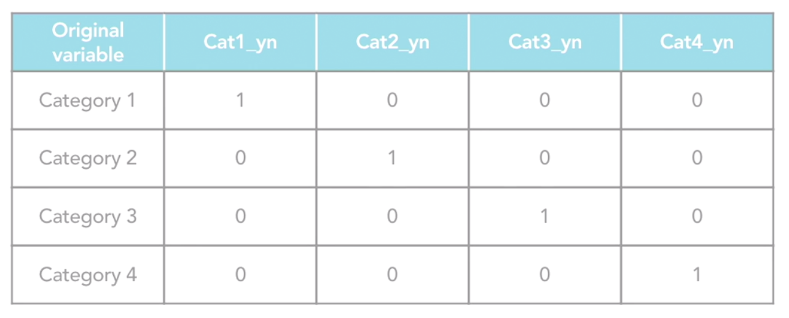
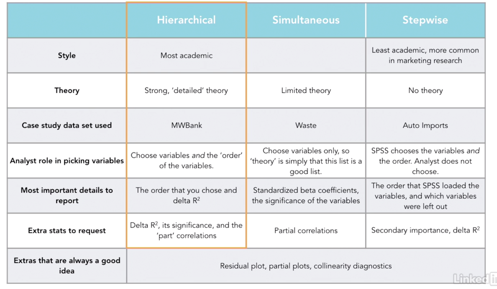
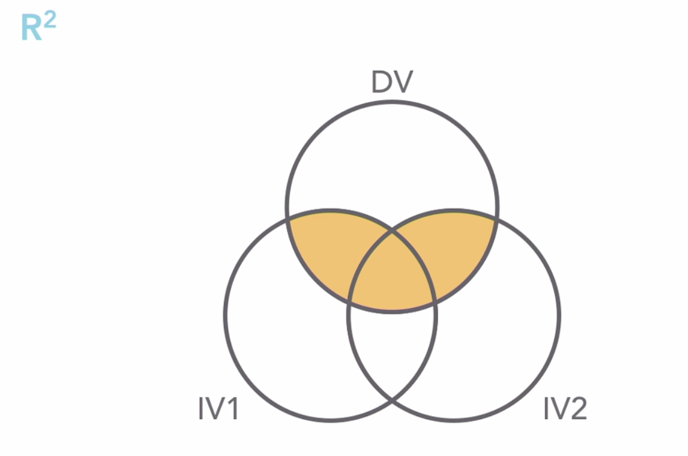
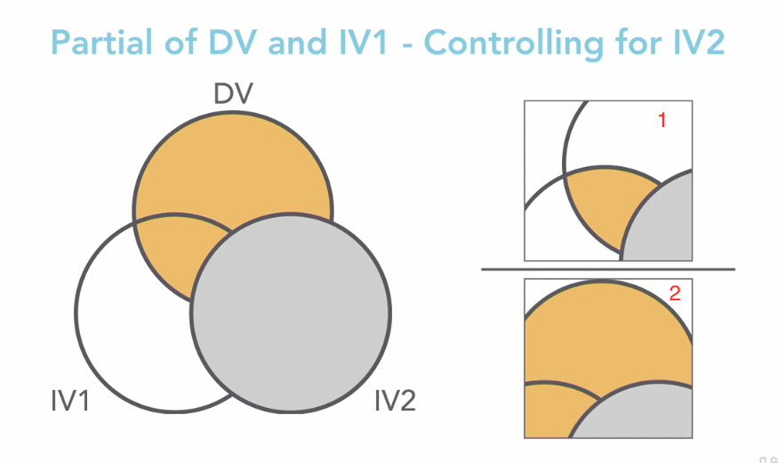
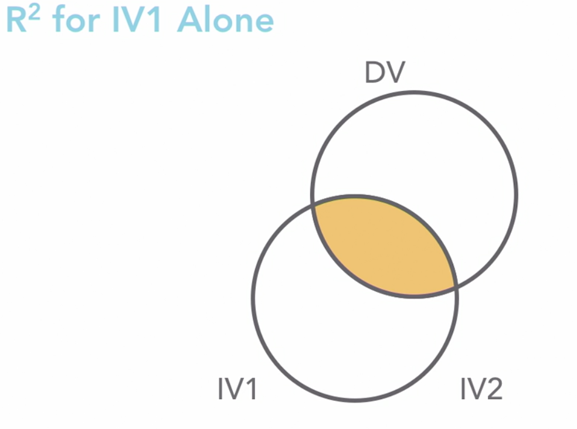
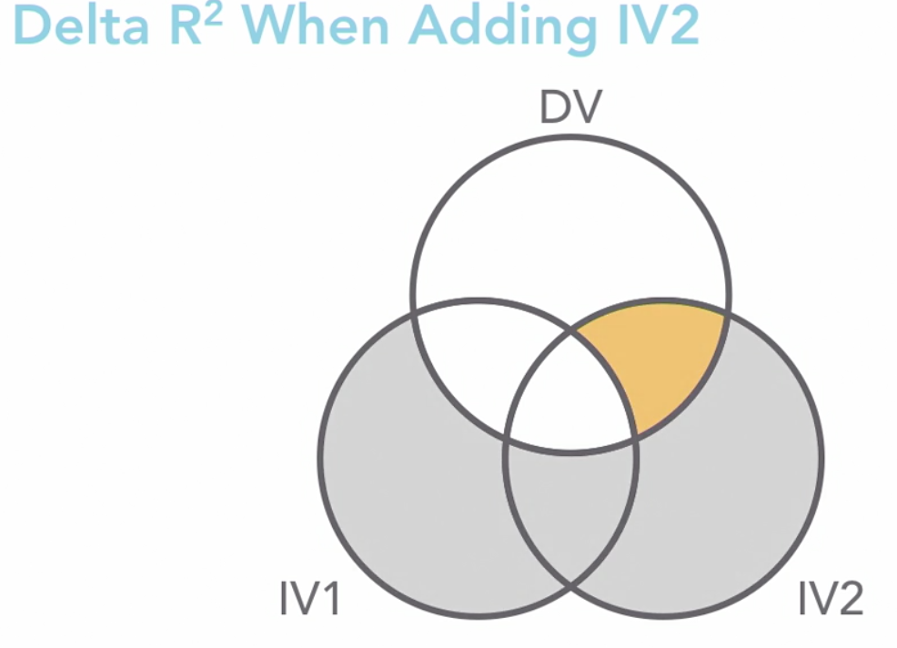
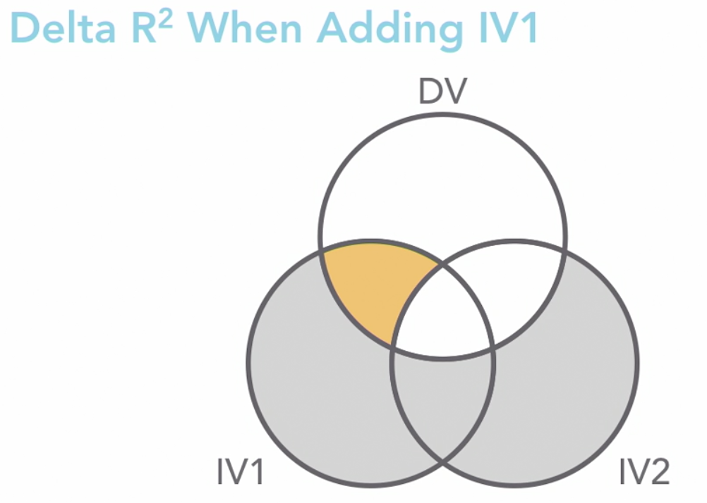
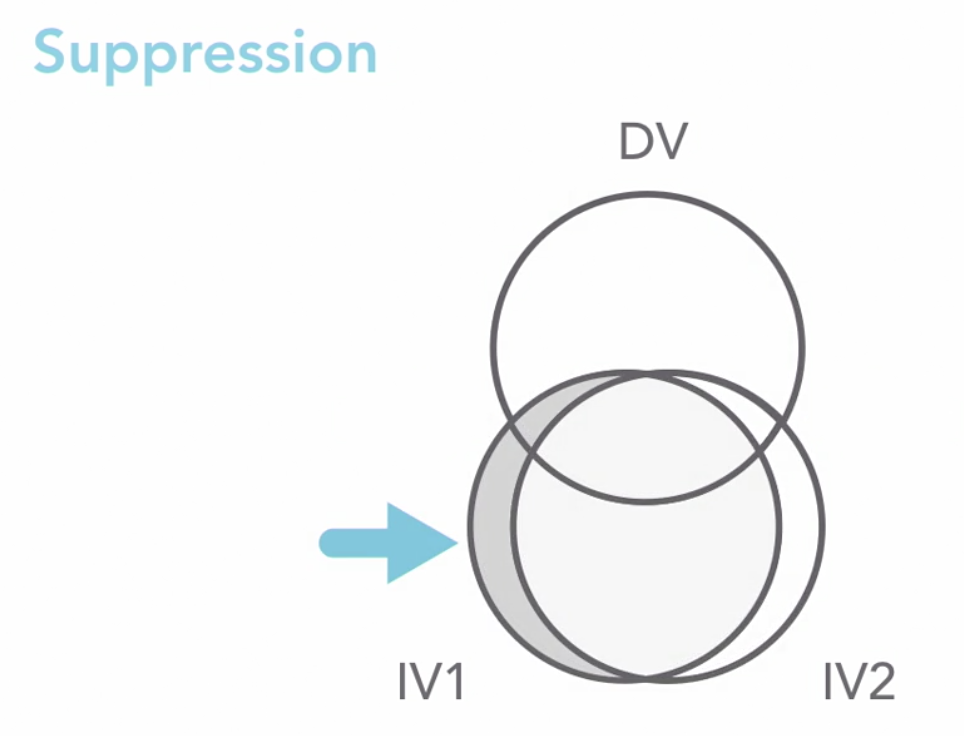
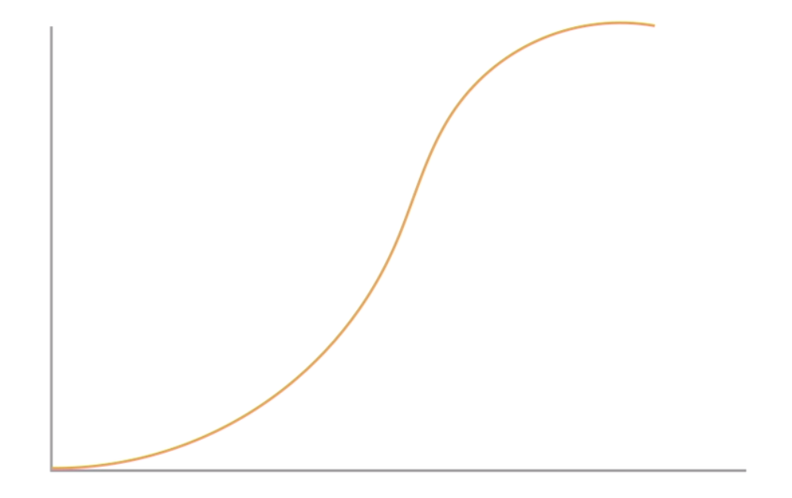
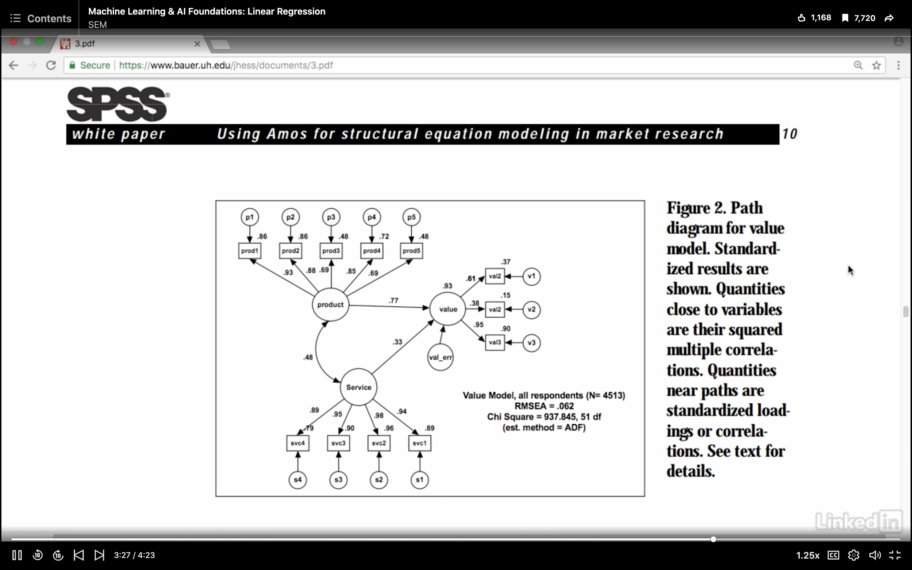

# Linear Regression

## Simple Linear Regression

* Total variance (R pow 2) = Variance explained + variance unexplained = sum of squares of distance from the mean.
* Variance unexplained is the sums of squares of distances from the regression line.
* Total variance can be found by finding the distances from the mean of the prices.
* Unexplained  var = variance with the linear regression line.
* explained variance = total - unexplained var
* R2 = (variance explained) / total variance
* % Variance explained = explained * 100 / total
* High percentage means our model fits the data well, if not we have failed to explain the data set properly.

## Multiple Regression

* ### Challenges and Assumptions

* #### Specification errors

  * 
  * B0 is the y-intercept, and bi.xi pairs are the variables and their coefficients and finally the error term.
  * Put all of the relevant variables in the model
  * Leave the irrelevant variables out.
  * The plan is to essentially have a good signal and minimal noise.
  * Need linear relationships.

* #### Regression Assumptions

  * Residual is the distance of a data point from its predicted value on the regression line.
  * Residuals have a mean of zero.
  * Normality of errors.
  * Residuals are not auto-correlated.
  * Need linear relationships
  * Need more data (usecases) than variables.
  * No excess multicollinearity.

* #### Regression Challenges

  * Visual examination becomes more difficult.
  * Multicollinearity, when you have a single variable this is not a problem but in multi-regression it is!
  * Interactions.
  * Attribute importance to each variable.
  * Juggling multiple problems all at once.

* ### Checking Assumptions Visually

  * Try and visualize the relationships between the dependent and independent variables before making any decisions.
  * You'd prefer a good regression line and a normal distribution ideally.
  * A point to be noted here is that if the relations violate normality and regression but they all have a similar shape, it's not quite as bad.

* ### Checking Assumptions with Explore

  * Case processing summary: tells us what cases were run for which variables.
  * Mean, median, variance, std. deviation, minimum, maximum, range, inter-quartile range, skewness, kurtosis. Trimmed mean is also a good indicator in which the top and bottom numbers and recalculate.
  * If the mean is many times more than the median that means the distribution is left/positively skewed.
  * Stem and leaf plot
  * Box and whiskers: displays whiskers on the low and high end, the mid of the box is the mean and it also shows outliers and extreme outliers.
  * The outliers in one of the cases can be used to see if it follows the same pattern in other cases.

* ### Checking Assumptions: Durbin Watson

  * If the Durbin-Watson value is fairly close to 2, the relationship is a healthy one.
  * In general, the value lies between 1.5 and 2.5

* ### Checking Assumptions: Levine's test

  * In Levine's test, a very low significance value means that the variables are not normally distributed.

* ### Checking Assumptions: Correlation matrix

  * A simple correlation matrix between all variables tells us the correlation of all variables with each other.
  * A correlation of 1 is of course perfect. but a higher correlation means that individually, that variable is the strongest, the lower the correlation, the weaker the variable.
  * The same table can also be used to check the relationships of dependent variables with each other.
  * When the correlation between 2 independent variables is high, we can run into multicollinearity. Which occurs when the independent variables are highly correlated with each other. Essentially the info in one will be almost identical to the other.
  * Another type of multicollinearity can be changes in direction i.e. when one variable goes up, the other goes down.

* ### Checking Assumptions: Residuals

  * The plot of Z-score residuals (Y) vs Z-Score Predictions.
  * In an ideal residuals plot, we want the errors to be concentrated at 0,0.
  * If that's not the case, that means there's something wrong with the model. Either we have to add a relationship, add a variable or maybe deal with the curvilinearity.
  * If there is a symmetry about the errors, we're definitely missing some key thing

* ### Checking Assumptions: Summary

  * Put all of the relevant variables in the model.
    * Check to see if the residuals plot show a random pattern, if yes, that's a good sign, it means we're on the right path.
    * Check for the presence of interactions i.e. one of the relevant variables might've been missed out.
  * Leave the irrelevant variables out.
    * Check for the statistical significance of all Independent variables and remove the irrelevant ones.
    * Check the partial residual plots for each and we should see a nice and clean linear relationship.
  * Need linear relationship.
    * Use curve estimation and scatter plots to diagnose.
    * Maybe squaring one of the variables will help.
  * Residuals have a mean of zero and normality of errors.
    * Check for normality of IVs using Levene's test before building the model.
    * Check the mean error of the residuals.
  * Multicollinearity
    * Correlation matrix before you model
    * Collinearity diagnosis after you model.
  * Serial auto-correlation (time series data)
    * Durbin-Watson test
    * If the dataset fails the DW test, maybe we need to use time-series-forecasting and time-series-forecasting maybe a better fit for this dataset.

## Dummy code amd Interactions Terms

* ### Creating dummy codes

  * If you have categorical variables, you will have to do some dummy coding, since you can't feed that data directly into regression.
  * 
  * The tools generally don't complain about using categorical variables like scale variables.
  * You can code gender as male_yn and female_yn, but having a variable for all possible values results in perfect multicollinearity and not just good correlations but perfect correlations.
  * So you have to leave one of the variables out and group with that value becomes the reference group.

* ### Detecting variable interactions

  * One way to do this can be to plot the dependent variable in a scatter-plot and use another variable to group the values of the dependent variable.
  * Eg. Plot Beginning Salary vs Education Level Group (Color) by Sex of Employee (MWBANK) and draw a regression line for the two groups.
  * However, just having 2 different regression lines is not enough to conclude relationship between the 2 independent variables, the slope for the 2 lines should also be different.

* ### Creating and testing interaction terms

  * There are multiple ways to tackle multicollinearity, one classic way is to create a new variable which represents the interaction.
  * For ex. Education * Sex and since the multiplication is highly dependent on education, the two will be highly correlated.
  * We follow a process called centering to tackle this. eg. take the value of education level and subtract the average of the variable values from it.

## Three regression strategies

* ### The strategies and when to use them

  * 

* ### Understanding partial correlations

  * The value of 1 variable is proportional to the other variable.

* ### Understanding part correlations

  * Delta R-Squared = The contribution of the variable after having taken care of all variance offered by all of the previous independent variables.

* ### Visualizing part and partial correlations

  * **Partial Correlation**
    * 
    * 
      * Partial R2 for IV1 = (yellow part of fig-1 )/ (yellow part of fig-2)
    * 
      * Partial R2 for IV1 = (yellow part of fig-1 )/ (yellow part of fig-2)
    * The denominator changes for different variables. Hence, even though the partial r2 is important, it causes the following problems
      * Trickier to compare, but we can always compare the magnitudes.
      * More importantly, we don't get the total R2 even after adding them all.

  * **Part Correlation**
    * 
    * 
    * 
    * Part correlation is essentially the additional variance explained/total variance.
    * Also, sum f all delta r2 = total variance
    * 
    * Suppression is closely related to severe multicollinearity and cause all kinds of issues.
      * Positive relationships might look like negative relationships.
      * Things might become unstable in general and can cause all sorts of problems.

* ### Simultaneous regression (Waste)

  * Ideally, we should've explored the data and the variables to be used before this step.
  * Adjusted R-square was designed to deter people from having too complicated a model, so as the **number of variables** goes up, the **Adjusted R-Square** goes down.
  * We always want our **Standardized Beta Coefficients** to be between -1 and 1, if the value for a variable crosses the limits, that indicates **severe multicollinearity.**
  * Also, even though all of the correlations are positive, some of the beta are negative, this is another indication of severe multicollinearity.
  * The partial correlation for fabricated metals is very low and so in the significance for it, so we should look to run the model without it.
  * Ideally we want the residuals to be centered around zero, The residuals plot is not centered around (0,0) but spread across. Hence, normality of errors is not observed or that the error are skewed.
  * In conclusion we want to look at the following things in case of simultaneous regression:
    * Coefficients.
    * R squared.
    * Residuals plot.
    * Partial plots.

* ### Hierarchical regression (MWBank)

  * We don't want to include any variables that came into existence after the dependant variable. Eg. Current salary.
  * Either put the variable in a meaningful chronological order or in order of importance.
  * Even though we've already put in centered education and the titles, the additional 2.3 % because of Sex of Employee is quite significant and this can be used in the court of law.
  * Again, in the final model, the zero-order coefficients for Sex of Employee say that R-squared is 25% which is significant.
  * It is evident that 2 of the job categories seem to be non-significant, but whenever there's a group of related variables, either all of them go in or none of them. The less significant ones just mean that they're very close to the base value variables (Clerical in this case).
  * The histogram is not that bad, just a little skewed to the left, which should be okay.
  * The residuals plot shows a big clump of numbers at (0,0) but there are some more chunks to the left and some to the right, there is some scattered-ness, but we're okay since the model as a whole seems to be doing well.
  * We want the errors to be somewhat random and clumped at (0,0).

* ### Stepwise regression

  * The method's options are:
    * **Stepwise/forward**: works in forward direction, i.e. selects the most prominent variable first and then the next and so on till there are no more significant ones.
    * **Removal/backward**: put all of the variables in and discard the ones that are not helpful
  * We have a small data-set so if we put all variables in then we'll probably have multicollinearity. So we'll use stepwise or forward.
  * Stepwise regression is not the best option to show which variables are the most useful ones. Simultaneous or hierarchical are more useful for that. The reason is: it has picked some variables for the dataset at hand but for a slightly different dataset, it might pickup another set of variables.

## Spotting Problems and Taking Corrective Action

* ### Collinearity (waste)
  
  * **Collinearity Tolerance**: only a small fraction of the IV variance is not explained by the other IVs i.e. the unique contribution of the IV is not large enough. Which could result in multiple variables fighting over the same variance.
  * **Variance inflation factor**: if we have all 5 IVs, the width of confidence interval of Restaurants and Hotels is 9274. The VIF values for everything other than industrial is ~ 5 - 8.5, which is pretty big.
  * Variance in general is R-squared, so the square-root of VIF gives tells you how much wider the variance is really is as opposed to what it could be.
  * From previous experiments we know that the correlation between retail and restaurants is high, also trucking and fabric also have a high correlation, we will now remove the weaker variables from both of the pairs and analyze again.
  * In general it's said that
    * Collinearity Tolerance is in the danger zone if > 1.
    * And VIF is in the red zone if it's > 10.
  * In our case, the VIF and the tolerance have both dropper by *A LOT*
  * The confidence intervals are much less wider, the VIF and Tolerance have gone down quite a bit.

  * **Dealing with multicollinearity: Factor analysis/PCA**
    * We use some factor analysis algorithms and remove any IVs that are correlated.
    * The result of this diagnostic in the waste case are 2 Factor Scores, which have perfect Tolerance and VIF of 1, but this can't be explained to anyone else.
  * **Dealing with multicollinearity: Manually combining IVs**
    * Adding retail and restaurants takes out the collinearity by combining them into a single variable.
    * At times, it can be a good idea to average out the values of some variables into a new variable.

* ### Outliers

  * **Dealing with outliers and influential points**
    * Influence: how much the presence of a point is moving the values.
    * To use Cook's influence values, you try and check if there are some values which are much higher than the major chunk of values, these will have a huge influence on the regression lines.
    * DFF_1: having the same outlier in the dataset moves the value of males by 213 dollars, which is again much higher than any of the other data points.
    * DFB1_1: this value illustrates that anyone with 12 years of education will have their salaries moved by ~28 * 12 = ~336, if this case is included.
    * The larger the dataset, the lower the impact of outliers.

  * **Dealing with outliers: studentized deleted residuals**
    * The point is to think about qualitative difference of the outliers as compared to the other data points.
    * We basically create a new variable and give it the same value for all data points and a different value for the outliers. Then we run regression with the new variable. If the new variable is significant, we know that the outlier has a big impact on the model.
    * Instead of just deleting/removing the outliers, maybe we can discuss with an SME and have another variable which can explain why they are outliers.
  * **Dealing with outliers: should cases be removed?**
    * Sometimes you just have to delete some data points.
    * We run the Cook's and studentized stats on the waste dataset and we find a single case whose industrial is moving the value by 156 , the beta for industrial is -53, so it's almost 3 times the beta coefficient, let's delete this case and try again.
    * After deleting the outlier data point, the beta values becomes -203, the relationship could've changed to a positive from a negative one.
    * Whenever we find an outlier, we should know the reason behind it.
    * If it just doesn't belong to the data population we're working with, we should remove all such cases and not just the outlier.

* ### Detecting curvilinearity

  * If we draw beginning salary vs education level, plotting only for males and we add a quadratic fit line, we can see that the R-square jumped up quite a bit!
  * Also, R-square can go up for various reasons, we need to check if it jumped up enough to be relevant. As it will also have some negative implications.
  * A quadratic line also means that we'll have a education and education squared.
  * Next we plot the two lines together using curve estimation and the r-squared does go up by 20% for quadratic.

## Other Approaches to Regression

* ### Automatic linear modeling (auto imports)

  * These default settings can be used to get a first level info about the variables, outliers and missing values.

* ### Regression trees (cart, auto imports)

  * Variables like make are not a great option to use in regression trees in our case, since we only have a few cases per make and this might result into our tree over-fitting, so might have to look to remove the variable completely.

* ### Time series forecasting (Australia retail sample)

  * Similar to linear regression but used in time/date based cases.
  * In the Australia retail sample dataset, we have just 2 variables, date and turnover.
  * Time-series case use just one variable to predict itself with a time lag using the (previous month's data as input or maybe even the previous year data due to seasonality).
  * The weird cardiogram like data represents seasonality, which is one of the vary important aspect of such datasets.
  * Even if you have multiple variables, in general it is better to use time-series forecasting in date/time wise data.

* ### Categorical and ordinal regression (satisfaction)

  * Same as linear regression, used when there are only categorical OR ordinal variables available.

* ### Neural networks

  * Based on previous observations, we know that there's curvilinearity in education level and sex and education level are related variables.
  * In case of regression, the analyst or the modeler has to create new variables by combining or by adding square of education level as a new variable.
  * In case of neural networks, we need to tell the tool that sex is categorical but work ex and education level are scale.
  * Neural nets hide the coefficients, significance and other statistical complexities using the hidden layer and a lot of coefficients.

* ### Binary logistic regression

  * In regression we generate the value of Y.
  * 
  * In logistic regression we generate a probability for a particular which lies between 0 and 1. The formula for odds looks as below.
  * 
  * So when we go ahead and make predictions, the formula looks a little different.
  * 
  * It's different because we don't build a line here, instead we plot a curve with an asymptote and 0 and 1, like below.
  * 
  * Logistic regression is very commonly used in epidemiology (study of diseases) and in marketing research. Ex. dark chocolate is good for you, wine is bad for you etc.

* ### Path Analysis and structural equation modeling (SEM)

  * Sort of combines regression and vector analysis.
  * 
  * If you want to use linear regression for this usecase, you'll go about it something like this:
    * Establish that A predicts B.
    * B predicts C.
    * A predicts C.
    * A fails to predict C if you control for B.
  * Essentially you'd build 4 models, and even then it'd be very hard to explain this to anyone.
  * With SEM, you can achieve it all pretty easily at the same time.
  * 

* ### Others

  * OLS (ordinary least squares) assumptions not met.
  * Nonlinear regression and curve estimation
