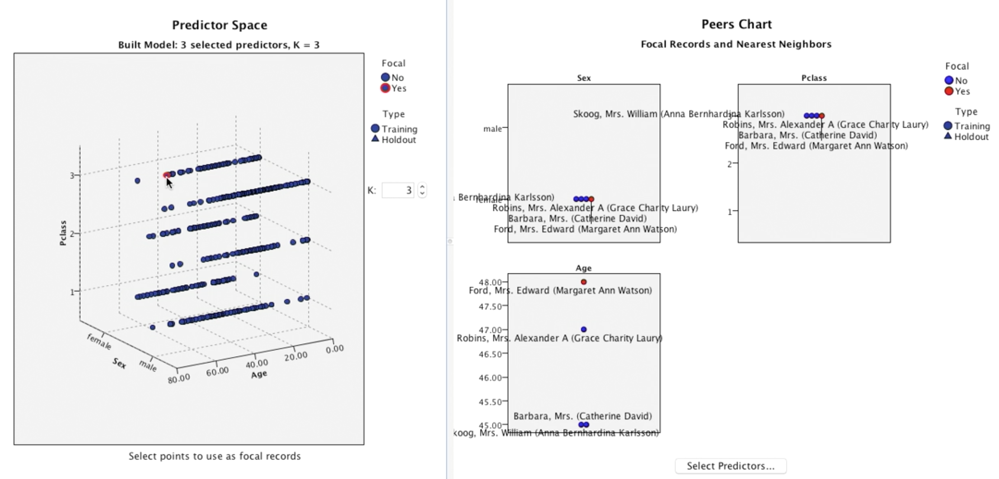
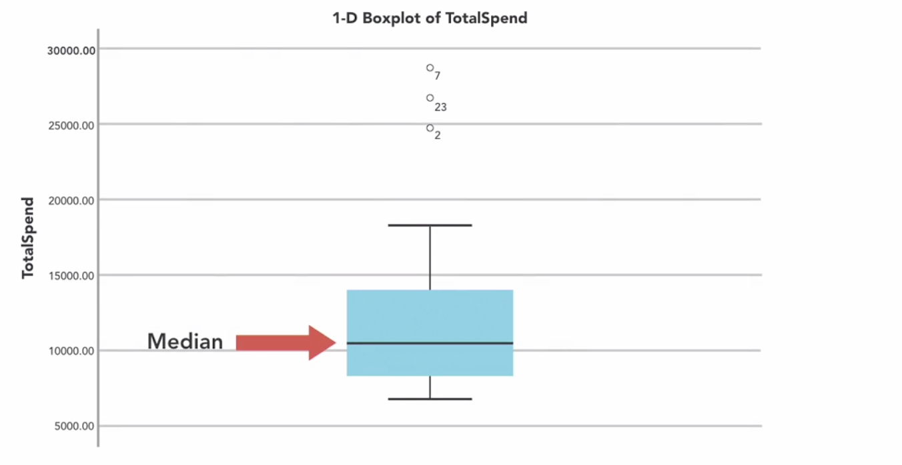
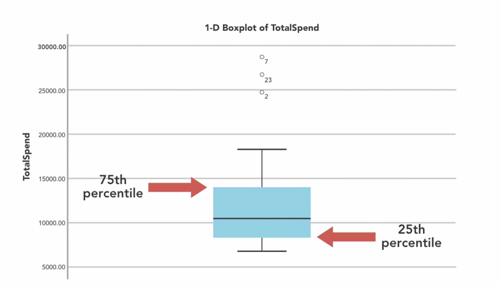
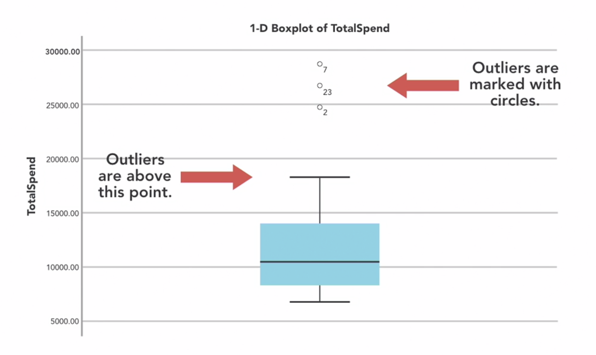
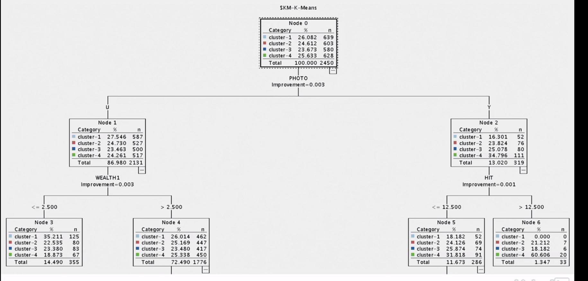
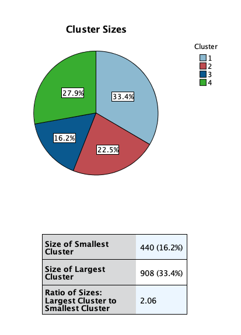
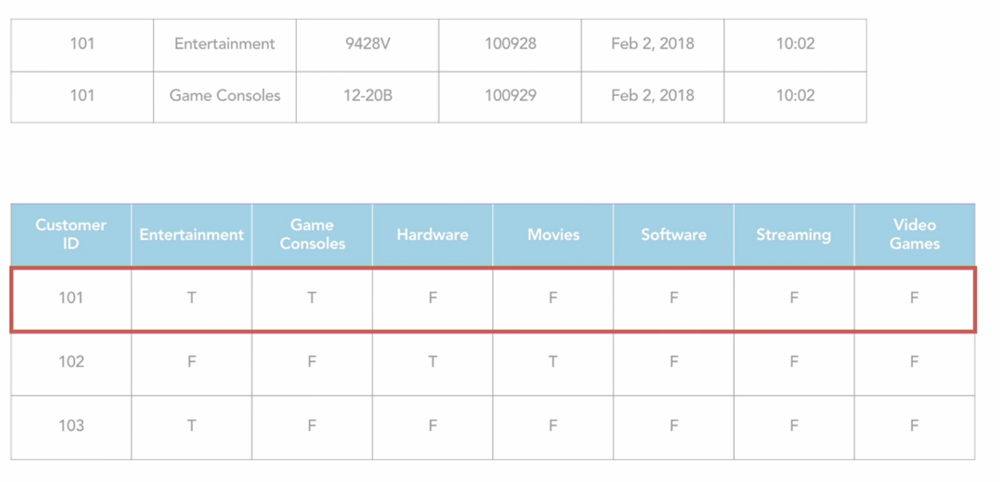
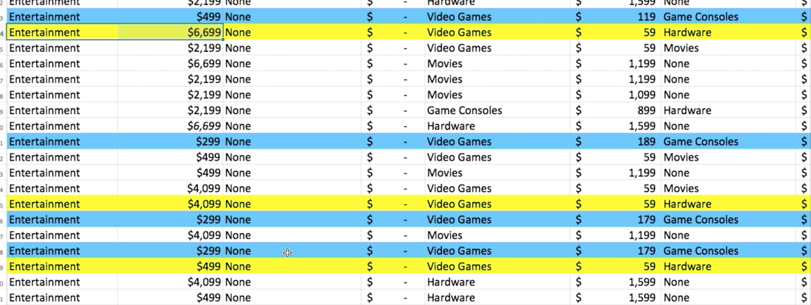
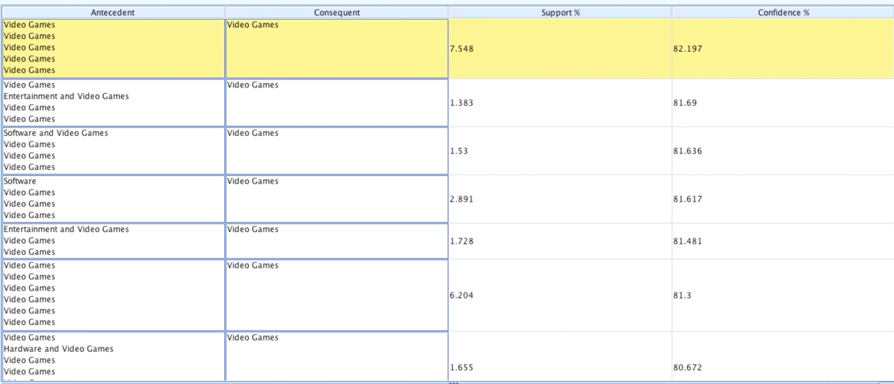

# Clustering and Analysis

## Cluster Analysis

* ### 2D scatter plots (ReadyForCluster)

  * We plot video game expenses vs hardware expenses.
  * The reasons for a bad scatter plot are:
    * Too many cases
    * Highly skewed (tons of users have zero, but some have a lot of expenses in these categories)
  * We add a horizontal and a vertical line at means, which divides the cases into 4 categories:
    * Zero on hardware and zero on video games
    * High on video games and zero on hardware
    * High on hardware and low on video games
    * Finally, a huge chunk of the plot is occupied by above average spend on hardware and above average spend on video games.
  * You don't generally run cluster analysis on 2 even 3 variables.
  * You do it on 10, 20 or 30 variables to find groups of similar data-points or if looking at the cases with some other grouping criteria makes sense.

* ### Understanding hierarchical cluster analysis

  * Used to find groups and try and make clusters with close data points.
  * The issue with hierarchical is that it requires too much computation. For ex. it requires n^3 computations. And this goes out of hand if we have many data points.
  * It can be used when it makes sense to look at a smaller dataset.

* ### K-nearest neighbors

  * With a target variable, you turn KNN into a classification technique.
  * To use it as a clustering technique, you want to just calculate neighbors,
  * 

## K-Means

* ### How does it work

  * K-Means builds upon hierarchical and does it efficiently.
  * Hierarchical we measure distance of every point from every other point and have to iterate through as many times as we have cases i.e. n^3 times.
  * We have to tell the value of K to K-Means, it finds 3 well spaced points and makes 3 groups and finds the centroids of those clusters and refine the solutions a little.
  * So although it doesn't make just one pass at the data, but it only makes a handful passes.

* ### Which variables should be used with K-Means

  * You generally want to work with scale variables which measure similar things, have the same scale and unit and then you want to standardize them.
  * There are techniques to combine categorize to combine the two types: for ex. you can build a clustering solution for the scale variables and then apply the categorical variables to build the final model.

* ## Interpreting a box and whiskers plot

  * 
  * The shaded region represents 50% of the population.
  * 
  * Outliers stay outside the whiskers, marked with circles and labels so that we can look them up in the dataset.
  * 
  * It doesn't really work too well for huge datasets, but it can be a good way to get a high level view of a medium sized dataset.
  * The data points that go way beyond the whiskers are called **Extreme outliers or extremes**.

* ### k-means cluster analysis

  * K between 3 and 8 and number of fields at 10 and 30.
  * The comparative box and whiskers plots show that none of the clusters have any significant spends in the Software and Streaming heads.
  * Also, a lot of the people in all clusters seem to be big spenders in one head and have almost zero spends in the other heads. This can indicate that these might be one time spenders and we can consider removing 1 time spenders.
  * Overall, we might look to drop a variable or two and one time spenders.

* ### Silhouette plot

  * We create a scatter plot, take points one at a time and measure its distance from all other points in a cluster, this is called cohesion. We want these distances to be small.
  * In addition, we then bring the other cluster in and try to find the amount of separation.
  * By measuring the cohesion within a cluster and the separation in between clusters, we get the ratios which is the bases of silhouette.

* ### Which cases should be used with k-means

  * Don't be afraid to remove cases which don't provide any new info.
  * For ex. in a gold study, the company knew that old golfers play a lot, so we can look to remove them from the analysis, since the analysis won't give us anything new about them.
  * Clustering is an exploratory technique, if you don't get results, make adjustments and try again.
  * Another reason for the one-time shoppers could be the cash-customers, so you'd want to discuss this with the SME before going ahead.

* ### Finding the optimum value for k

  * **k=3**
    * Just like always, we see a heavy TV spender group but almost nothing else in any other areas.
    * We can see some relations, 2 clusters show some relation between hardware/console and video games.

  * **k=4**
    * Just like always, we see a heavy TV spender group but almost nothing else in any other areas.
    * One cluster has very high spends on game consoles, median on hardware and some spends on video games.
    * Another cluster has average on hardware, way high on movies and below average on video games.
    * The 4th cluster is very high on video games, the highest on hardware, these guys look like gamers.
    * Neither of the 2 say too much and too well to be selected yet.

  * **k=5**
    * One of the clusters is much smaller than the others. In general, you want to look into the group and see if it's a interesting/relevant one, if not, we may look to exclude this one from the analysis.
    * We see a heavy TV spender group but has some activity in the hardware and video games group.
    * Another is high on game-consoles and a little on hardware and video games (gamers with 2 platforms).
    * One is high on hardware and above median on video games but the graphs are cleaner this time.
    * One more is very high on movies and video games and median on hardware.
    * Last one is very high on games and above average on hardware.
    * THe last 2 clusters which were a medium sized cluster in k=4 have been broken down and one of them is ~5%, so we need to make a decision on the inclusion of the cluster and if increasing k even makes sense.

  * **Best solution?**
    * There are no straight=forward answers for: what's the best cluster?
    * We build clusters using auto-clustering for k =3 to 8 and the best one SPSS says is k=3.

## Visualizing and Reporting Cluster Solutions

* ### Summarizing in a table

  * We've already converted amounts into ratios, so that the heads with a bigger dollar count like TV and consoles don't dwarf the smaller ones like video games and movies.
  * However, this doesn't mean that the big guys don't care about the amounts.
  * In this usecase, the dependent variables will just be the scale variables and the dependent variable will be the k-means solution and we'll plot sum, mean and number of cases.
  * From the means we can see that cluster-1 has a HUGE amount of spends as compared to any other clusters. The average spend on TVs is ~ 950 dollars, but cluster-1 has an average spend of ~4000 dollars. For other clusters, very few of the members bought a TV, which is why the mean is very low.
  * If we check the sum, it's quite evident, cluster-1 has a TV spend of 2.25 million dollars, whereas the total spends from the other groups combined is less than 400 k dollars.

* ### Traffic light feature in excel

  * Even if you removed some of the variables down the line, you still want to include them for reporting purposes.
  * We only want to see the means this time around.
  * We basically represent the spend in percentages using Green for higher than mean and red for lower than mean spends

* ### Line graphs

  * Before building line-graphs, you want to correct names and labels and change them with something relevant to the company maybe get some help from the SMEs for this.
  * Again, even if we haven't used all of the variables in clustering, we still want to use them in the plots.

## Cluster Methods for Categorical Variables

* ### Relating clusters to categories statistically

  * Often, you don't need to include the categorical variables in the model.
  * What you need to do is, once the clusters are ready, run the categories against the cluster memberships.
  * We build a cross-tab with K-Means as the column and categorical variables as the rows and look at the chi-scores and the significance values.
  * We find that photo, number of children and Mail-code are some of the significant variables for the clusters we had created. This doesn't mean that we had to include these 2 in the clustering and should rather use them in phase 2 after the cluster analysis.

* ### Relating clusters to categories visually

  * Now we we use clusters for color, photos as x-axis and the percentage for each x-axis category in a clustered bar chart.
  * We're showing the percentage within photography-yes and photography-unknown (the data probably came from a share in a photo magazine or from a software related to photography).
  * The graph shows the distribution of photo-yes or photo-unknown on cluster basis.

* ### Running a multiple correspondence analysis

  * You should do cross-tabulation, pearson-chi-score or something similar before this step to find out the categorical variables which are most related to the cluster membership variable.
  * This algorithm works best when you have labeled data with numeric code instead of strings, so you'll have to transform your categorical variables into numeric codes.
  * We also want to use the number of children variable, since the distribution is highly skewed (3 people with 5 kids and 12 with 4 against a total of 2700 cases), the algorithm will struggle to convert this.
  * So we recode them into a new variable with 0 -> 1; 1,2 -> 2; 3+ -> 3.
  * Now we start with **dimension reduction->optional scaling** algorithm on the variables: KMeans, photo_num, goldstar_num, gender_num, homeowner_num and Numchild_bin using all of them as analysis variables and building joint category plots for all of them together.
  * The resulting join category plot is called a perpetual map.

* ### Interpreting a perpetual map

  * The **BIG GUYS** seem to love this in compared to tabular data and bar charts.
  * The gender female seems closest to cluster-3, gender joint seems to be closer to cluster-1.
  * Cluster-4 seems to be closest to goldstar false and photo_num yes etc.
  * No other graph can be used to display this many number of variables with this little complexity!

* ### Using cluster analysis and decision trees together

  * CLuster analysis and decision trees are a powerful combination.
  * There rarely is a need for categories in the cluster analysis.
  * Concentrate first on the cluster analysis using variables that are somewhat related and which make sense.
  * The cluster data is usually the data that is harder to get. For ex. it's much easier to get zipcode data for customers than it is to get the spending patterns for them, you need to go through logs, transaction, purchases etc. and colalte them to reach it.
  * Then bring in categorical data-which is usually easy to get.
  * Phase Two is very important in case of cluster analysis
    * Make the cluster solution the target of a supervised learning model.
    * Now take the categorical data and make them inputs for the decision tree.
    * If you can acquire the categorical data on new customers, you can predict their cluster membership. Which might be a rough estimate of what they will spend over the next year.
    * 
    * The author seems to have used decision trees as phase-2 in 2/3rds of his cluster analysis projects.

* ### A BIRCH/two-step example

  * This algorithm allows for the users to put categorical variables in, but one shouldn't go crazy putting in all of the categorical variables and be vulnerable just because it allows you to.
  * We might look to do that in case of anomaly detection i.e. put in all of the categorical variables we have, but not for building the model.
  * **Euclidean distance** works only with scale variables but **log-likelihood** can work with both.
  * The algorithm will also recommend a value for K for the K-Means algorithm.
  * 

* ### A self organizing map (Kohenan Maps) example

  * It's a flavour of neural networks that create a map as the out put and can take any type of variables.
  * The cluster viewer is not a good choice for viewing a self organizing map, you'll have to honor its map property and view it as one.
  * The farther the members are in the map, the less similar they are, the closer the are, the more similar they are. This can be used for anomaly detection.
  * The algorithm basically starts with the input and a number of neurones, all of the neurones are connected to each other, it runs the inputs one by one, and moves the closest neurone a little closer to the input, but since the neurones are connected, all of the other neurones also move a little. This process is repeated for all inputs and finally, all of the inputs are grouped with their corresponding neurones.

## Anomaly Detection

* ### The k = 1 trick

  * In a supervised learning algorithm, you can use historically known fraudulent transactions and make that a target variable.
  * One of the algorithms is to use k-means with k = 1, we put all of the input variables in and let it run.
  * It's not a good idea to do this in case of modeling but for fraud detection, it might be okay.
  * The anomalies will be very far away form the centre when you make a single big cluster for all of the records.

* ### Anomaly Detection Algorithms

  * BIRCH's algorithm suggests the number of clusters, we'll create those clusters and calculate the distance of every point from the centroid the the cluster they belong to.
  * You'd run the anomaly detection version of it and look for the boolean variable which says whether or not a particular data point is an anomaly or not.

* ### Using SOM for anomaly detection

  * In general going for supervised learning to detect anomalies is a good idea, but supervised learning requires known cases/examples, but with unsupervised, you might be able to detect new fraud methods in the making.
  * There are some smaller cluster, which are small in size, these point to some anomaly in the transaction in those clusters.
  * Essentially you can summarize with the following points:
    * Business rules suggested by SMEs.
    * Supervised learning methods using known outcomes
    * Unsupervised learning to find new and unusual patterns.

## Association Rules and Sequence Detection

* ### Introduction

  * You just need the customerId and the SKU or maybe the transactioId and the SKU, the level of granularity changes in the 2 cases.
  * Sequence analysis includes dates, since we're sometimes interested in data like: the customer bought item x and a few days item y. In general it's not applied to retail data analysis but used in web mining and predicting maintenance.
  * You might even sometimes look into data like following:
  * 

* ### Running Association Rules

  * The id that's used for the analysis depends upon the usecase, if you can track the customerId throughout the data, you can go with the customerId but if you're looking at cash customers data, you have no way to link different transactions form them. so you go with basketId.
  * Again in the content we have 2 choices, productCode and productId, productId is the more granular one here.
  * It's always better to run all 4 combinations.

* ### Terminology

| Term               | Description                                                                                                 |
| ------------------ | ----------------------------------------------------------------------------------------------------------- |
| Antecedents        | One of more **"If"** choices                                                                                |
| Consequents        | One or more **"Then"** subsequent choices                                                                   |
| Confidence         | % of time the **"If""** choices result in the **"Then"** choices (accuracy of the rule)                     |
| Rule support       | % of all transactions that have both **"If"** and **"Then"** choices                                        |
| Antecedent support | % of all transactions that have the **"If"** choice                                                         |
| Lift               | How many times more likely a customer is to choose the **"If"** with the **"Then"** just the **"If"** alone |

* ### Interpreting association rules

  * The rules with 100% confidence may not always be all that great, since they might reveal stuff like, the game console that comes with battery, or requires batteries etc.
  * You also don't want to be on the opposite end where the rule confidence is too low or the rule support is too low.

* ### Putting association rules to use

  * The generated rules are not of much use to the marketing team or anyone else unless you clean them up and pull product level and group level info.
  * 
  * The blue highlighted group is the **Console Gamers** and they tend to buy cheaper TVs.
  * The group highlighted in yellow are PC games, and they buy TVs from a variety of price range.
  * Although the SKUs in both of the groups are different, we still can club the members of these groups and have a single marketing campaign, but in the mails we send to them, we mentioned the SKUs specific to them.

* ### Comparing clusters and association rules

  * Clustering and association rules are somewhat 2 sides of the same coin.
  * In contrast, there are only 4 clusters and we have thousands of rules, so they are much more granular and cover much lesser of the population.
  * Nonetheless, custer-1 are the biggest TV buyers, they also spend some money on video games, much lesser on the other categories. If you take a closer look, this group is willing to shell out big sums and has shown brand loyalty (we kicked out one times shoppers).
  * If we now switch to rules which had entertainment as the antecedent, and Video Games/Game Consoles, we can send them some promotions and have them shell out bigger sum on the consoles or video games category.

* ### Sequence Analysis

  * We'll use customerId, TransactionDate and Product Category as the variables to be analyzed.
  * 
  * The first rule which reads "People that bought 5 video games, will buy a 6th one", this is just spam, but rules like these pop-up in sequence rule analysis all the time and they'll be kicked out.
  * Also, the sequencing in the rules may not always be required, for example, whether Pizza then beer or Beer then pizza, may not be critical, just the association may ne enough.\
  * The sequencing is important in cases of **Web Mining and Predictive Maintenance**. An engineer needs to know the sequence of events that led to the failure of a machine.
