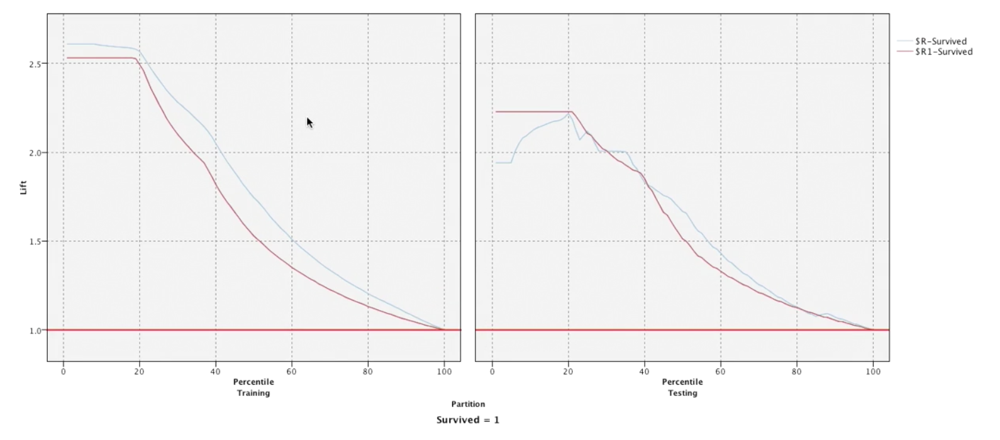
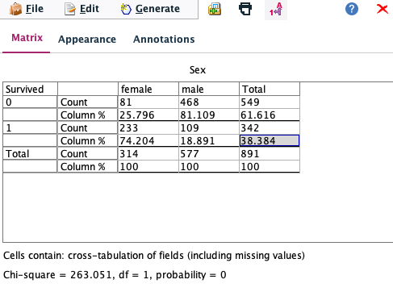

# Decision Trees

## Decision Trees in IBM SPSS Modeler

* ### Building 2 quick CHAID & C&RT models

  * If we leave the models as is after creating 2 separate CHAID and C&RT models, they'll both go their separate ways.
  * We want to hook the models up like a train car and combine the results of the 2.

* ### Analysis mode

  * When we analyze the performance of the 2 models, we see that CHAID performs better on the training data but does ~7% worse on the test data.
  * C&RT does worse in training data but does better in test data and only drop ~ 3%.
  * The two models agree with the predictions ~ 82% in both training and testing data.
  * The combined model (we only check the agreement cases) performs better on the training data ~ 90% but fails to be consistent in the test data at ~ 83%.

* ### Lift and gains chart

  * Lift charts tell you, how much more likely is a passenger to survive based on the models.
  * 
  * On the left are the results of the training data set and on the right, the test data set.
  * The drop from the left chart to the right chart indicates at first that maybe we're not really doing great on the test data set, but the drop is only about 0.25% and close enough to be okay.
  * X axis is most likely to survive at 0 to least likely to survive at 100.
  * We can interpret the chart like this:
    * One of the leaf nodes of the tree which has most likely to survive comes to the left half whereas the least likely to survive nodes would come near the right edge.
    * Moreover, the line itself represents, the top 20th percentile of people (at 20 on x-axis), are more than twice as likely to survive as the general population.
    * The 40th percentile, they too are more likely to survive.
    * Also, other than the initial predictions, the 2 models agree most of the time.

## Understanding CHAID (**CH**i-squared **A**utomatic **I**nteraction **D**etection)

* ### Chi squared overview

  * 
  * When we create a matrix for Survival vs Sex in SPSS Modeler, we can see that the overall survival rate is ~ 38.5 % whereas the sex-wise survival rate is: female: 74%, male: 19%.
  * In this case, the value of chi-squared probability is zero, since the difference between the percentages of males and females is quite different, if they were closer, it'll be 1 or close to 1.
  * What a zero value means is that the survival (output variable) is heavily dependent on the sex of the person (input variable).
  * In general, this is what CHAID does, runs the chi-squared analysis for all variables and puts them in the order of increasing probability as input variables.

* ### Building a CHAID tree interactively.

  * The auto-generated model puts sex at the top since that has the lowest chi-squared probability but we can choose to work with other indicators.

* Bonferonni adjustment

  * 