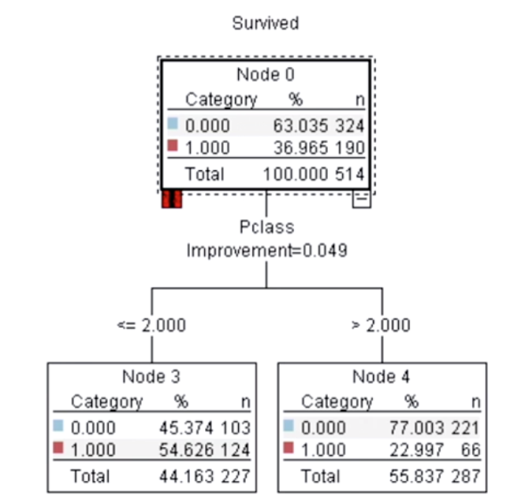
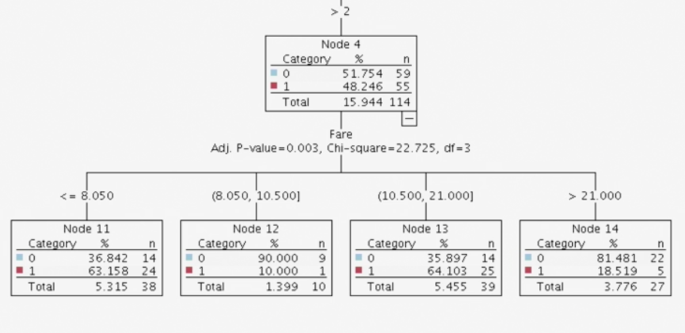

# Decision Trees

## Decision Trees in IBM SPSS Modeler

* ### Building 2 quick CHAID & C&RT models

  * If we leave the models as is after creating 2 separate CHAID and C&RT models, they'll both go their separate ways.
  * We want to hook the models up like a train car and combine the results of the 2.

* ### Analysis mode

  * When we analyze the performance of the 2 models, we see that CHAID performs better on the training data but does ~7% worse on the test data.
  * C&RT does worse in training data but does better in test data and only drop ~ 3%.
  * The two models agree with the predictions ~ 82% in both training and testing data.
  * The combined model (we only check the agreement cases) performs better on the training data ~ 90% but fails to be consistent in the test data at ~ 83%.

* ### Lift and gains chart

  * Lift charts tell you, how much more likely is a passenger to survive based on the models.
  * 
  * On the left are the results of the training data set and on the right, the test data set.
  * The drop from the left chart to the right chart indicates at first that maybe we're not really doing great on the test data set, but the drop is only about 0.25% and close enough to be okay.
  * X axis is most likely to survive at 0 to least likely to survive at 100.
  * We can interpret the chart like this:
    * One of the leaf nodes of the tree which has most likely to survive comes to the left half whereas the least likely to survive nodes would come near the right edge.
    * Moreover, the line itself represents, the top 20th percentile of people (at 20 on x-axis), are more than twice as likely to survive as the general population.
    * The 40th percentile, they too are more likely to survive.
    * Also, other than the initial predictions, the 2 models agree most of the time.

## Understanding CHAID (Chi-squared Automatic Interaction Detection)

* ### Chi squared overview

  * 
  * When we create a matrix for Survival vs Sex in SPSS Modeler, we can see that the overall survival rate is ~ 38.5 % whereas the sex-wise survival rate is: female: 74% and male: 19%.
  * In this case, the value of chi-squared probability is zero, since the difference between the percentages of males and females is quite different, if they were closer, it'll be 1 or close to 1.
  * What a zero value means is that the survival (output variable) is heavily dependent on the sex of the person (input variable).
  * In general, this is what CHAID does, runs the chi-squared analysis for all variables and puts them in the order of increasing probability as input variables.

* ### Building a CHAID tree interactively

  * The auto-generated model puts sex at the top since that has the lowest chi-squared probability but we can choose to work with other indicators.

* ### Bonferroni adjustment

  * All implementations for CHAID provide this.
  * The adjustment says that the value of alpha goes down as the number of cases increases.
  * However, the drawback is that as the number of tests starts going up, the value of alpha with Bonferroni adjustment becomes too low and the tree stops growing.
  * The advice for the Bonferroni adjustment is:
    * Generally leave it on
    * If the tree doesn't grow, experiment by turning it off.
    * Be careful whenever turning it off, consider making significance lower than 0.5.
  * The issue with turning it off is that you might have too complex of a tree (over-fit) which doesn't work well on new data. So **always validate** on new data.

* ### CHAID: handling of nominal variables

  * The modeller found 4 values for the variable **Embarked** and separated it into two groups: Q and S are combined but C is with the ones with missing data (indicated with **blank**) in the model.
  * 
  * The modeler can be forced to split the data into 4 different groups, but as displayed above, the percentages for Q and S are too similar to be separate and although the percentages for C and blank are quite different, the sample size for blank is just 1.

* ### CHAID: handling of ordinal variables

  * The modeler made 2 groups out of Pclass, **less than 2** and **greater than 2**.
  * 
  * 1 and 2 aren't very close as such, they are closer to each other than they are to 3. But since CHAID runs statistical tests, 1 and 2 are not significantly different. And since the sample size in this case is very small, they have been combined, if the sample size was ~ 10000, they would certainly have been very different.
  * The difference between the handling of Nominal and Ordinal is:
    * In case of Nominal variables, anything can be combined with anything.
    * But in case of ordinal variables, only the close variables can be combined. i.e. 1 and 2 or 2 and 3 can be combined but not 1 and 3.

* ### CHAID: handling of continuous variables

  * Chi-square can't be run on continuous variables, so the values are broken down into deciles. Deciles = percentiles/10
  * The modeller converts the age variable into deciles (of ~50 in size) and breaks it down into 2 groups: less than 13 and greater than 13 + missing.
  * 
  * Nodes 14-19 except for 18 have ~ 50 cases, 18 has 240 cases which essentially means that 5 deciles have been combined into 1.
  * The percentages for nodes 15-19 have similar percentages for survival and even though they are a little bit apart in some cases, but not significant enough to be a separate leaf.
  * But node 14 which essentially means children, follows the notion of **women and children first**.

* ### A look at the whole tree

  * 
  * A few observations are:
    * Although the overall survival rate is 38%, 75% of the females have survived.
    * Within that group all 57 females of <= 24 years of age have a 100% survival rate.
    * Node 9 here could easily be the result of an over-fitting tree, and that it could just be happening because of the small sample size, since node 8 & 10 both have almost 100% survival rate.
  * 
  * A few observations are:
    * Males have an overall survival rate of 19%.
    * The only exception being the young males with one or no siblings with a survival rate of 95%, which is node 15 and in contrast node 16 with young males with 2 or more siblings have only 15% survival rate. This is another set of leaf nodes which could just be a fluke or a false positive since the total sample size for this group is 30.
    * A similar pattern appears in case of young males 12-24 w.r.t embarked, the ones who embarked at C have 30% survival rate but the ones from Q,S have a 5% survival rate. Node 17 again has a very small dataset.
    * In the adult men group, the unmarried men didn't do as well as the married men, the survival rate in node 21 (1st class passengers that have 0 siblings and spouse) is 30% whereas the same for node 22 is 56% (>0 sibling-spouse). Also, under node-21, the survival rate for males with age < 35 is 72% whereas the rate for males > 35 years of age is only 20%.

## Understanding C&RT (Classification and Regression Trees)

* ### Gini coefficient

  * In economics, it measures if everyone has the same income or if there is some income inequality.
  * A Gini coefficient of 0 expresses perfect equality, where all values are same. For ex. everyone has the same income.
  * A Gini coefficient of 1 expresses maximum inequality. For ex. a large number of people, where only one person has all the income or consumption and all others have none, the Gini coefficient will be nearly 1.
  * 
  * An **Effective Tree** will always have **Pure** leaf nodes.
  * In the survival case, it'd mean that some nodes will have mostly survivors and the others wil have mostly non-survivors.

* ### Weighing purity and balance

  * Purity is typically measured with the variation of the Gini Coefficient.
  * Balance is simply the left and right branches the same or similar number of cases.
  * C&RT always produces binary splits, meaning it always splits into 2.
  * 
  * C&RT produces the above split by default, it may not be balanced, but the number of survival in the left and right child nodes are purer than earlier. The left node has almost 2/3rds and the right node has 1/3rd survivors which will lead to purer leaf nodes.
  * 
  * On being forced to be a little more balanced, the nodes split into 238 and 276 but both of the child nodes have similar survival rate, so it doesn't help in terms of purity.
  * 
  * On being forced to be perfect purity, node 22 has perfect purity but only one node, which is again, not desirable.
  * This is why we need a balance between purity and balance.

* ### Handling of nominal, ordinal and continuous variables

  * It had a reputation of being slow in the 80s.
  * C&RT is computationally intensive because it tries out all of the possible cut-points.
  * **Continuous variables**
    * 
    * In the example above, it'll find youngest traveller, put it on the left node and all of the others on the right, then it'll put the 2 youngest on the left and the other on the right and so on.
    * So in contrast with CHAID, C&RT can try out quite a few cut-points for continuous variables whereas CHAID could only work with deciles.
  * **Nominal variables**
    * 
    * The categories can be set to either side and all possible combinations are tried.
    * The best improvement in purity wins
    * In contrast with CHAID, **blank** is not considered separately in C&RT, however if we had handled it and declared it as missing, it would've been.
  * **Ordinal variables**
    * 
    * Almost the same as nominal, just that the combinations to be tried will be 1 vs 2&3 and 1&2 vs 3.

* ### Handling of missing data

  * CHAID considers **missing data** as a category, but in C&RT, the only split is: < 3.5 and > 3.5.
  * C&RT basically uses surrogates (variables related to the one with the missing data) and predicts, if the age is > 3.5 or not. For ex. if the person with the missing age is married, he's definitely older than 4.
  * With CHAID, you have to look at the missing data and where it's coming from, but in case of C&RT, the surrogates technique works quite well, even if you have 5-10% or even a little more missing data.

* ### Understanding (cost-complexity) pruning

  * If we just un-check the **Prune tree to avoid over-fitting**, the tree becomes much bigger and has 23 nodes.
  * C&RT starts from the bottom and starts pruning the branches that are complex but don't contribute very much to the accuracy of the tree.
  * We measure the complexity by the number of leaf nodes.
  * So if a branch has a lot of leaf nodes but isn't aiding in the accuracy of the tree, it's pruned.
  * The authors of C&RT tried out a lot of combinations, but they found that the results were best when they grew the tree to max and then pruned it in the above mentioned way.
  * We can turn it off to see more info about where the tree might go, if another layer is added.

* ### A look at the whole C&RT tree

  * It's much smaller than CHAID.
  * C&RT was initially somewhat less accurate than CHAID but it was stable and worked almost similar with test and train data which was not the case with CHAID and that made us rethink our CHAID algorithm.
  * Node 5 is the only leaf node with a small sample size of 12.
  * We could look to build additional branches beneath node 6 which has a sample size of 328.
  * The start of the 2 trees is the same.
  * But in the next level, it changes drastically, the highest survival rate is for 1st and 2nd class females at 98% and the lowest in this tree is 16% for older infants (>3.5 i.e. not infants).
  * Looking at the 2 trees, we feel that the C&RT tree could do with some additional nodes and the CHAID tree could have some fewer nodes to perform better.

## Improving the models

* ### Stopping rules in CHAID and C&RT

  * **Parent-child sample size**
    * The minimum number of samples in a parent node to be broken down and in the child to be created.
    * More important to not have a conservative value in case of C&RT since this may negatively affect pruning, which is something C&RT relies on heavily.
    * Changing the values to absolute 50/100 and 25/50 in CHAID, didn't seem to make a difference in either of the case.
  * **Tree Depth**
    * The maximum number of levels the tree is allowed to have.
    * Trying out a higher number of levels (6/7) in a CHAID tree can lead to better results, so it should be tried out. In case of C&RT, going up to even 8 might make some sense, since it's known to build larger and skinnier trees than CHAID in general and it helps to have a bigger tree available for pruning.
  * **Confidence level (CHAID)**
    * If you reduce the significance level for splitting to 0.01, that means you want a 99% confidence for splitting, which would lead to a tree, that'll have grown less.
    * However, if the tree is not growing as expected, you can consider setting the value to 0.1 and expecting a confidence level of 90%.
    * In case of CHAID, this is the most important stopping rule to manage the growth of the tree.
  * **Minimum change in impurity (C&RT)**
    * Adding a zero in the default value allows the tree to grow more and removing it, limits its growth.
    * This is the most important setting in case of C&RT.
  * Rather than removing Bonferroni adjustment or Pruning, these are the more important settings or techniques, which will allow a control over tree growth and to improve the model.

* ### Exhaustive CHAID

  * The original CHAID had 5 levels, the difference between the regular and exhaustive CHAID is in the way they merge.
  * 
  * CHAID would convert the values into deciles and make pairs to combine and then the enxt pair and so on till there are no more pairs left to combine.
  * Exhaustive CHAID keeps going even when CHAID would've stopped.
  * 
  * The CHAID tree grows less because of the Bonferroni adjustment since it runs more tests, the significance becomes lower.

## Conclusion

In the end, the trick is to try out various different versions of the same and many different models to try and reach the best possible solution.
