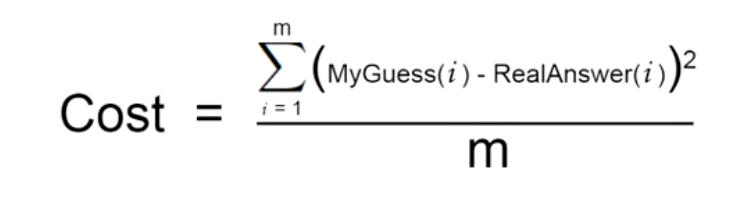
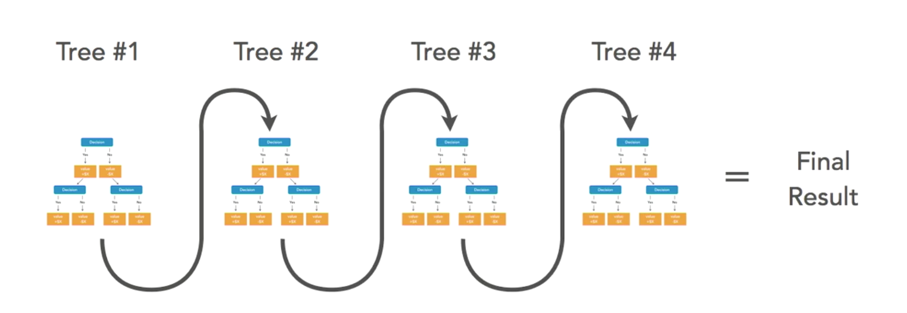
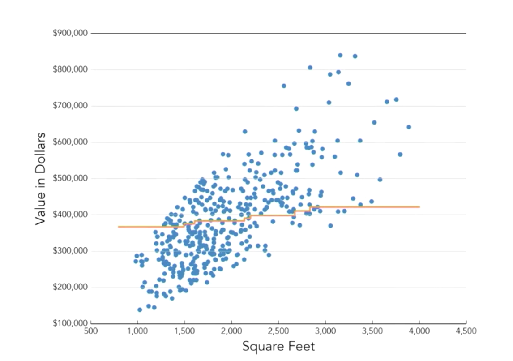
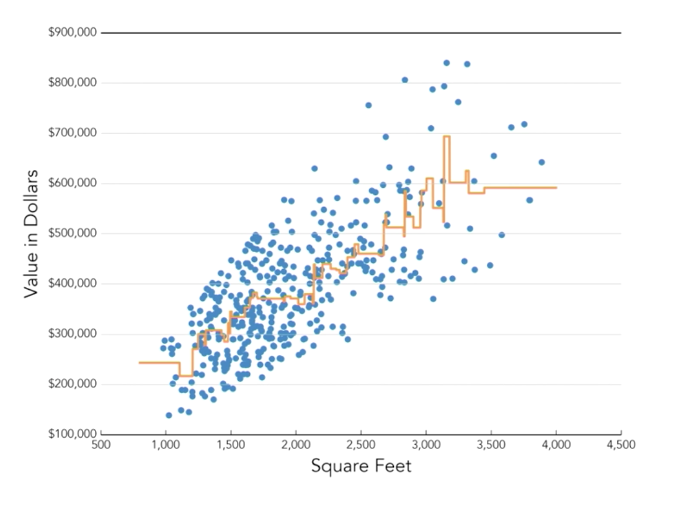
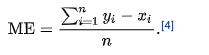

# Value Estimations

## A Simple Value Estimator

* We take the 3 samples we have and make equations like:

```python
estimate = 50000 + (size_in_sqft * weight1) + (number_of_bedrooms * weight2)
```

* 
* We need to find weights which minimize the cost.
* **Gradient Descent** is an iterative optimization algorithm which can be used to minimize the cost and find the best weights.
  * Cost function and random starting weights are passed to the algorithm.
  * It tweaks the weights iteratively in an attempt to minimize the cost function (targets zero).
  * The results in our case are 92.1 and 10001.
* We built a basic estimator using the following steps:
  * Create an equation to model the problem.
  * Create a cost function to quantify the error in the model.
  * Use an optimization algorithm to find the model parameters that minimize the cost function.

## Overview of the Learning System

* ### ML Workflow

  * Get data
  * Clean and preprocess data
  * Shuffle the data
  * Split data into training and test
  * Set model hyper parameters
  * Train the model
  * Evaluate the model
  * Use the model to predict new data

* ### Gradient Boosting

  * Uses an ensemble of decisions trees to predict values.
  * 
  * 
  * 

## Training Data (how much data should you have?)

* Data should cover as many combinations of features as possible.
* You should aim for at least 10x more data points than the number of features.
* More data is almost always better (but not always necessary).
* You should have data related and similar to the dataset you're trying to predict.

## Features

* ### Feature Engineering

  * Using your own knowledge of the problem to choose features or create new features that allow the ML algorithms to work more accurately.
  * To get the best results from ML, only the features which correlate strongly with the output values should be included.
  * Including useless features can harm the accuracy of the overall system.
  * Approaches:
    * Adding or dropping features, choose the features that have the most signal. For ex. number of potted plants is a feature which will no have real impact on the value of the house.
    * Combining multiple features into one, the goal is to represent the data in the simplest way possible. For example, height in feet and height in inches like 4ft, 2 inches. We can just combine the two into a single total height in inches.
    * Binning: replacing an exact numerical measurement with a broader category. For ex. we can replace the feature pool-size into a boolean which says whether there's a pool in the house or not.
    * One-hot encoding: a way to represent categorical data as numbers. For ex. the neighborhood for houses are a set of strings. It'll be hard for any machine learning algorithms to process that. One way to tackle this is to assign numbers to neighborhoods, but some ML algorithms can also face issues with this, they will assume that the order of the numbers is significant and that bigger numbers are more important than the smaller numbers , which is not the case. We basically create n boolean-like variables to denote n values of the categorical variable.

* ### Choosing the best features

  * We'll use one-hot encoding to convert garage field into a set of booleans.
  * House number and unit number don't make a difference, so we'll drop them.
  * city and zip-code imply each-other so we'll use only one of them.
  * Street number can be a good variable, but it's quite complicated to hot-code, since we'll end up having 1 boolean for every field present, so we'll skip it for now.

* ## Curse of Dimensionality

  * As the number of dimensions (features ) in the data increases, the number of data points required to build a good model increases exponentially.
  * For example if we have just one feature to predict house price: square feet, the coverage for the area vs value plot will be great even with just 50-100 rows, but if we add a third dimension: number of bedrooms, 100 data points may not be nearly enough to have a good spread.

## Measuring accuracy with Mean Absolute Error

* It looks at every prediction the model has made and tells us how wrong our model was across all predictions.
* 

## Improve Our System

* ### Overfitting and Underfitting

  * We can indirectly tell if our model is overfitting or underfitting based on the difference in error rates on the training and test datasets.
  * If the error rate for training data is very low but very high for test data, we're overfitting. We can reduce overfitting in Gradient Boosting by having fewer trees, having smaller trees (lower depth) and by having simpler trees (fewer leaves).
  * If the error rate is high for both the training and test datasets, we have an under-fit model. We can try and improve the model using a more complex model. Making more decision trees and deeper trees can be some ways to improve an under-fit model.
  * If the error rates for both the training and test datasets are low, that means our model is working well.

* ### Gird Search: the Brute Force Approach

  * We list out the range of settings we want to try and just try them all.
  * We finally select the ones with the best results.

* ### Feature Selection

  * We have a total of 63 features, some of them are very important, but the others may not matter too much and they can be removed from the model.
  * With a tree based ML model like Gradient Boosting, we can get to know how many times a certain feature was used to find the final price.
  * The values of feature importance from a model always add up to  1. So this can be used to validate how often a certain feature was used by the model.
  * In our case, most of the features seem to be getting used, but if you have a lot of features, this can come in handy.

* ## Retrain the Model

  * When the data changes, we need to retrain the model.
  * Retraining only requires updating the data set, not the code.
  * Retraining can be an automated recurring task.
  * We must always check the new model's accuracy before using it!

* Try out some algorithms like:
  * Support vector regressor (SVR)
  * xgboost library
