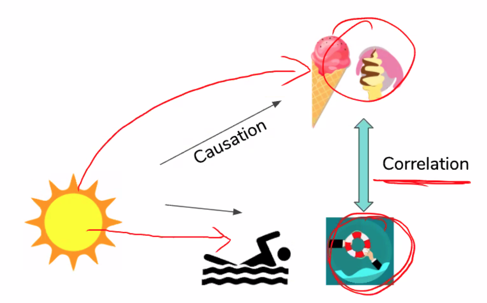

# ML with Python

## Python

* Lists, string and tuples are called sequences, they can be index and sliced.
* Strings and tuples are immutable.
* Read the exceptions/errors in python in a bottom-up approach.

## Basic Statistics

* 
