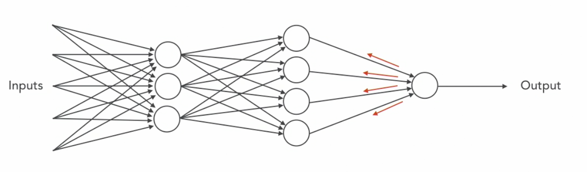

# Neural Networks

## INtroduction to Neural Networks

* ###  Neurons and artificial neurons

  * **Neurons**
    * 
    * 
    * Basic units of the brain, transmit information to other nerve cells.
    * They are excitable, produce electrical events (nerve impulses), which is the basic currency of brains.
    * Start a chain reaction
    * Dendrites pick up the impulse and send the message to the next neuron and the process goes on.
    * Once the message hits its target, a neurotransmitter is stimulated and causes action.
    * All of this happens within 7 ms.
  * **Artificial neurons**
    * The first neural that was built was a perceptron and the motivation came from **flies**
    * Flies use the the visual filters in their eyes to decide whether or not they should flee
    * The perceptron takes inputs, applies some functions and takes the weighted sum of the functions with bias to decide whether or not the action should be taken.
    * 

* ### Gradient descent

  * **Understanding loss**
    * The loss is a way to quantify the difference between the actual output vs the predicted output.
    * To improve a model's prediction, we want to minimize the loss.
  * We need to find a way to learn the neuron's parameters (weight and bias) from the data.
  * **Gradient Descent** is an optimizing algorithm which iterates through different combinations of weights and biases to find the combination which minimizes the error/loss.
  * Some loss functions are: sum of squared errors, cross-entropy loss (better suited for logistic functions)

## Components of Neural Networks

* ### Activation functions

  * An activation function determines whether a neuron fires or not.
  * To introduce non-linearity in the network, we need to have a non-linear activation function. Some examples are:
    * **Step function**: 0 or 1.
    * **Linear functions** don't help much, since the result of multiple linear functions is also a linear function.
    * **Sigmoid function**, output between 0 and 1. Faces **Vanishing gradient problem**: learning is slow near boundaries, since the slope is nearly zero around them.
    * **Tanh function** , output is between -1 and 1, similar problems to sigmoid.
    * **ReLU (Rectified Linear Unit)**, zero when x < 0, x when x >= 0. Is non-linear, and is computationally simpler than sigmoid. One of the popular choices.

* ### Back-propagation and hyper-parameters

  * 
  * 
  * In forward propagation, the gradients of the input layer are calculated first and then for the next layers in a forward manner, whereas in case of back propagation the gradients of the output layer are calculated first and then toward the input layers i a backward manner.

## Convolutional Neural Networks

* ### Convolutions

  * Fully connected neural networks typically don't work too well with images, they face scalability issues as the number of pixels increases. For ex. for an image with 32x32 pixels and 3 color channels a single neuron on the input layer will have 3072 weights. If the number of pixels is higher, the number will be significantly higher.
  * Moreover, having this many parameters will generally lead to overfitting.

* ### Zero padding and pooling

  * A Kernel/filter/matrix is convolved over the image in all possible ways.
  * 
  * A challenge with convolution is that we lose some data from the original image, as it reduces spatial size.
  * 
  * To avoid it, we can use zero padding.
  * 
  * In case of pooling, we take a 2x2 sub-matrix and take the maximum or average value of the 4 values based on the algorithm being used.
  * It's a form of non-linear down-sampling.
  * Reduces chances of overfitting.
  * But as the height and width decreases, you want to increase the number of kernels.
  * Max pooling is generally favoured, since the higher valued parts light up and also preserves the parts that were most activated (had the highest values)
  * 

## Enhancements to CNN

* Dropout
  * Randomly kill each neuron in the layers of a training set with probability p.
  * The purpose is to prevent over-fitting, only done on training data.
  * And the common p value is 0.5, which means that half of the neurons are dropped during training, which means that the model can not rely on the activation of any particular neurons at the time of training, so it has to learn more common and generic patterns.
  * 
* Image Augmentation
  * The images from the training dataset are manipulated and used to create additional data.
  * Which leads to having more images to train the model on.
  * It also makes our model more robust which can help in recognizing reflections etc.

## ImageNet

* A huge open-source image database.
* An annual competition to classify thousands of photos and place them in 1000 categories, the solution with the fewest errors wins.
* Based on WordNet hierarchy. Each concept is described by multiple words or **synsets** (synonym set)
* Continental glacier: Geological formation | ice mass | glacier | continental glacier
* Currently around 1000 samples per **synset**.
* 

## VGG16

* 

## Resources

* ImageNet
* <http://playground.tensorflow.org/>
* <https://colab.research.google.com/>
* FMNIST
* MNIST
