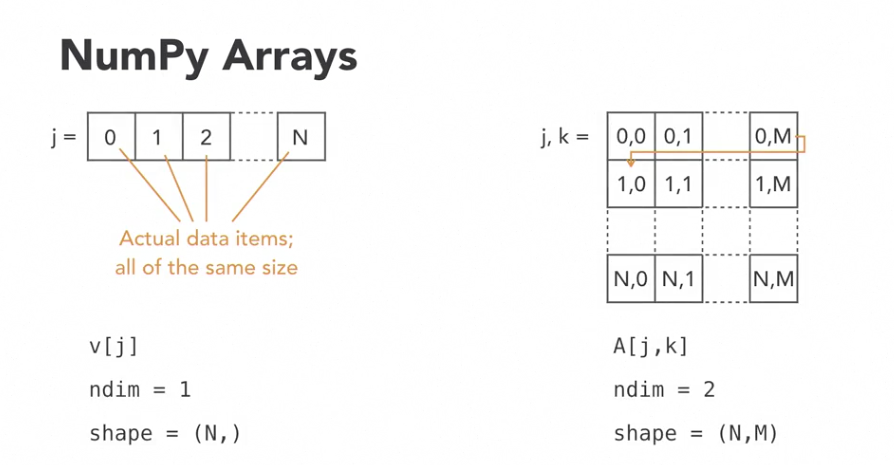
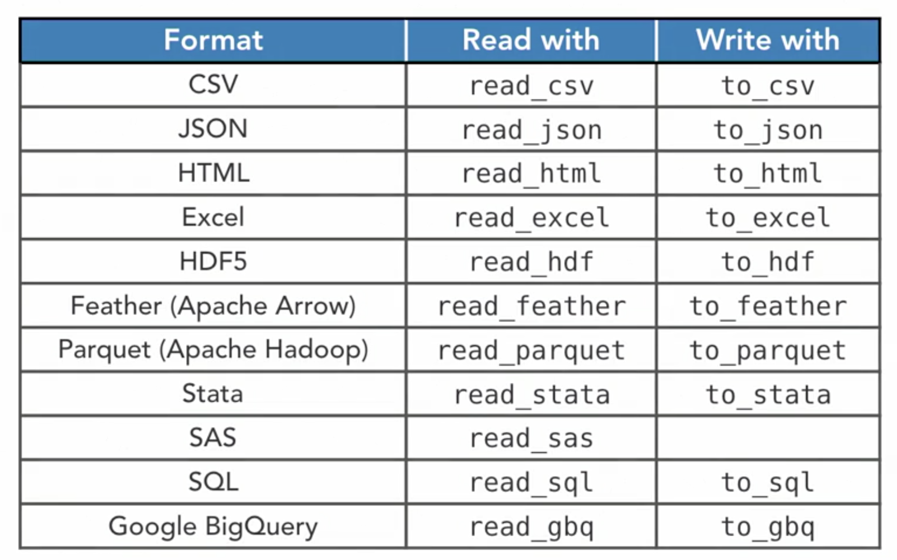

* ## **Jupyter Help**
    * Enclose formulas to have them formatted properly between $ signs. Eg. $\sqrt(1 + x)$
    * Esc-c to copy a cell
    * Esc-v to paste it
    * Esc-x to cut it
    * ctrl-m->d-> to delete the selected cell
    * Jupyter notebooks can be run on azure cloud as well.

    ----
* ## **Loops**
    * Basic definition:
        ```
        for i in iterator:
            # do something
        ```
    * The most common iterator is ```range([start], stop, [step])```, where stop is exclusive
----
* ## **Lists**
    * list.append to add an element at the end
    * list.extend to add multiple elements at the end of the list
    * List + list to concatenate
    * list.insert(i, elem) to change an element at a given position
    * del list[i] to remove by index
    * list.remove[elem] to remove by value
    * list.sort() to sort in natural order
    * sorted(ducks, reverse=True) to sort in reverse
    * Examples of slicing
        ```
        squares[0:2]
        squares[:4]
        squares[3:]
        squares[:]
        squares[0:7:2]
        squares[-3:-1]
        squares[2:4] = ['four', 'nine']
        del squares[4:6]
        ```
    * Tuples are like lists, except that the elements can't be modified or add new ones
    * Tuples and lists can be passed to functions with multiple variables like \*list or \*tuple
    ----
* ## **Dictionaries and sets**

    * ```capitals[key] = value ``` Can be used to add values to a dictionary
    * ```key in dict ``` Can be used to check if a key exists in a dictionary
    * ```dict1 + dict2``` doesn't work, we need to ```dict1.update(dict2)```
    * Anything hashable can be used as a key in dictionaries
    * ```hash('abcd')``` can be used to check the has of a given key
    * Looping over dictionaries can be done in multiple ways:
        ```
        for key in dict:
        for key in dict.keys()
        for value in dict.values()
        for k,v in dict.items()
        ```
    * dict.keys() is an iterator and can be made into a list using ```list(dict.keys())```
    * Order or insertion is preserved in dicts.
    * Can add to sets using ```continents.add('Antarctica')```
    * Can remove from sets using ```continents.remove('Antarctica')```

    ----
* ## **Comprehensions**
    * Comprehension examples:
        ```
        squares = [i**2 for i in range(1, 11)]
        squares_by_four = [i**2 for i in range(1, 11) if i**2 % 4 == 0]
        squares_dict = {i: i**2 for i in range(1, 11)}
        capitals_by_country = {'United States': 'Washington, DC', 'France': 'Paris', 'Italy': 'Rome'}
        countries_by_capital = {capital: country for country, capital in capitals_by_country.items()}
        # A generator is created if this syntax is used without the curly braces or with braces
        sum(i**2 for i in range(1, 11))
        counting = [j for i in range(1, 11) for j in range(1, i+1)]
        ```

    ----
* ## **Advanced Containers**
    * Named tuples can be created to avoid having to remember the indexes of data elements
        ```
        people = [("Michele", "Vallisneri", "July 15"),
          ("Albert", "Einstein", "March 14"),
          ("John", "Lennon", "October 9"),
          ("Jocelyn", "Bell Burnell", "July 15")]
        persontype = collections.namedtuple('person', ['firstname', 'lastname', "birthday"])
        namedpeople = [persontype(*person) for person in people]
        ```
    * Data-classes are an alternative to named tuples
        ```
        @dataclass
        class personclass2:
            firstname: str
            lastname: str
            birthday: str = 'unknown'
            def fullname(self):
                return self.firstname + ' ' + self.lastname
        
        michele = personclass('Michele', 'Vallisneri')
        michele = personclass(firstname='Michele', lastname='Vallisneri')

        ```
    * Default dicts can be used to pass a function to supply default values for keys.
    * Just querying a key addes it to the default-dict
        ```
        def mydefault():
            return "I don't know"
        questions = collections.defaultdict(mydefault)
        questions['The meaning of life']

    ----
* ## **Advanced Containers**
    * Idioms are code snippets that have become the preferred way to do things. Eg.
        ```
        words = []
        for line in open('words.txt', 'r'):
            words.append(line.strip().lower())
        # strip removes leading and trailing space, lower converts to lowercase
        words = {line.strip().lower() for line in open('words.txt', 'r')}
        words = sorted({line.strip().lower() for line in open('words.txt', 'r')})
        ```
    * Can even read other language words, since python 3 has strings in Unicode by default
    * ```'-'.join(sorted("aaron"))```
    * Anagram sample
        ```
        # make a dict that maps each signature to the set of words with that signature;
        # each signature will map to at least one word

        words_by_sig = collections.defaultdict(set)

        for word in words:
            words_by_sig[signature(word)].add(word)
        # keep only the key/value pairs where the set has more than one element;
        # this is now a regular dict

        anagrams_by_sig = {sig: wordset for sig, wordset in words_by_sig.items() if len(wordset) > 1}
        # handle case when myword's signature is not found, returning the empty set

        def find_anagram_fast(myword):
            sig = signature(myword)

        try:
            return anagrams_by_sig[sig]
        except KeyError:
            return set()

        # list of signatures, sorted by length, longest first
        sorted(anagrams_by_sig.keys(), key=len, reverse=True)
        # list of anagram sets, sorted by signature length
        [anagrams_by_sig[sig] for sig in sorted(anagrams_by_sig.keys(), key=len, reverse=True)]
        # list of anagram sets, sorted by their length, largest first
        sorted(anagrams_by_sig.values(), key=len, reverse=True)
         ```
    * itertools standard library:
        ```
        # list all combinations of two different elements from the set {1,2,3} 
        list(itertools.combinations({1,2,3}, 2))
        ```
    ----
* ## **NumPy**
    * The **fundamental package for scientific computing with Python**
    * Fast, memory-efficient N-dimensional arrays
    * Excellent choice for large homogeneous data sets
    * A foundation for many mathematical packages and to integrate pytho with C and Fortran
    * Variables in python are just labels, the actual values are scattered across memory and 1 value can have multiple labels attach to it.
    * This also allows Python data structures to have heterogenous values.
    * This is good for normal programs, but not efficient when we have to work with large sets of similar values.
    * NumPy reserves space in memory and stores the values side-by-side.
        
    * NumPy Data Types:
        * Integers: 
            * numpy.int8
            * numpy.int16
            * numpy.int32
            * numpy.int64
        * Unsigned integers:
            * numpy.int8
            * And more...
        * Floating point numbers:
            * numpy.float32
            * numpy.float64
            * numpy.float128
        * Complex numbers
            * numpy.complex64
            * And more...
        * bool
        * Fixed length str
        * numpy.void (record arrays)
        * Object
    * Numpy constructs:
        ```
        monalisa_bw = np.loadtxt('monalisa.txt')
        # Number of dimensions
        monalisa_bw.ndim
        # Shape
        monalisa_bw.shape
        # Number of elements
        monalisa_bw.size
        # Data type
        monalisa_bw.dtype
        # PyPlot method to display 2-D arrays as images
        pp.imshow(monalisa_bw)
        pp.imshow(monalisa_bw, cmap='gray')

        # Using npy file:
        monalisa = np.load('monalisa.npy')
        pp.figure(figsize=(10,16))
        pp.imshow(monalisa)
        ```
    * Create a numpy array with:
        ``` 
        fromlist = np.array([[1,2,3],[4,5,6],[7,8,9]])
        # With zeroes
        zero_1d = np.zeros(8, 'd') # 1D
        zero_2d = np.zeros((8,8), np.float64) # 2D
        # Create a zero array using another array
        np.zeros_like(monalisa_bw)
        # Or an empty one, where memory is allocated but not cleaned, so it's filled with garbage values
        np.empty(24, 'd')
        # Regularly spaced array of numbers using the defined extremes and the number of elements.
        linear = np.linspace(0, 1, 16) # numpy.linspace(start, stop, num=50)
        # Plot it with bigger points
        pp.plot(linear, 'o')
        # works similar to Python range function
        np.arange(0, 1.5, 0.1) # numpy.arange([start, ]stop, [step, ])
        # Array of random numbers
        rand_2d = np.random.random(size=(8,8))
        np.random.randn # Normally distributed numbers
        np.random.randint # Integers in a range
        # Save to a .npy file
        np.save('random.npy', rand_2d)
        # Save to a text file
        np.savetxt('random.txt', rand_2d)
    * NumPy arrays usage:
        ```
        # 3D array indices being access
        monalisa[600,400,0]
        monalisa[-50,-50,1]
        # Change the values at an index
        monalisa[600,400,0] = monalisa[600,400,1] = monalisa[600,400,2] = 0
        # Slicing
        pp.imshow(monalisa[400:800,200:600,0:3])
        # Show 2 dimensions in full
        pp.imshow(monalisa[400:800,:,:])
        pp.imshow(monalisa[400:800,...])
        # Stepping
        pp.imshow(monalisa[::20,::20,:])
        # Stepping in reverse
        pp.imshow(monalisa[::-20,::20,:])
        # Mixing slicing and indexing reduces the dimensionality of the array
        row = monalisa[20,::20,0] # A 1D array
        # Fixing an index is not the same as a slice of 1, that leave the array to be 2D
        rect = monalisa[20:210,::20,0]
        # Slicing can be used on the left side to do an assignment
        monalisa[20:300,20:300,:] = 255 # Creates a white block in the specified box
        # Replace with a random set of [pixels]
        monalisa[20:300,20:300,:] = np.random.randint(100,255,size=(280,280,3))
        # Fancy indexing: use arrays to index another array
        monalisa_bw[monalisa_bw < 120] = 0 # This selects pixels lighter and sets them to 0
        ```
    * Slicing a python list creates a copy of the list, hence changing something in a sliced list doesn't change the original one
    * A slice of a numpy array creates a new object that points to the same array of memory, so changing something in slice changes the original
    * To create a copy ``` monacopy = monalisa.copy()```
    * Mathematics with NumPy:
        ```
        x = np.linspace(0,5*math.pi,64)
        sinx = np.sin(x)
        pp.plot(x, sinx) # plots sin(x) vs x

        # multiple matplotlib.pyplot.plot() instructions superimpose lines
        # in the same plot, cycling colors so we can distinguish them
        pp.plot(x, sinx, label='sin(x)')
        pp.plot(x, np.cos(x), label='cos(x)')
        pp.plot(x, np.log(1 + x), label='log(1+x)')
        # shows legends
        pp.legend()
        ```
    * Can even work on multiple arrays of same size in one shot
        ```
        y = sinx * cosx
        z = cosx**2 - sinx**2

        pp.plot(x, y)
        pp.plot(x, z)
        ```
    * Broadcasting: when it can, NumPy tries to make sense of operations between arrays of diff size
        ```
        # Offsets the values in sinx by 1.5
        w = sinx + 1.5 
        pp.plot(x, sinx)
        pp.plot(x, w)
        ```
    * 2D NumPy math samples:
        ```
        #X-axis changes
        monalisa_bw = np.loadtxt('monalisa.txt')
        xgrad = np.linspace(0, 1, 134)
        monalisa_xgrad = monalisa_bw * xgrad

        # set nominal figure size in inches; show images in two adjacent subplots
        pp.figure(figsize=(8,5))
        pp.subplot(1,2,1); pp.imshow(monalisa_bw, cmap='gray')
        pp.subplot(1,2,2); pp.imshow(monalisa_xgrad, cmap='gray')

        # Y axis changes
        ygrad = np.linspace(0, 1, 200)
        ygrad = ygrad[:, np.newaxis] # adds a new y dimension
        pp.figure(figsize=(8,5))
        pp.subplot(1,2,1); pp.imshow(monalisa_bw, cmap='gray')
        pp.subplot(1,2,2); pp.imshow(monalisa_ygrad, cmap='gray')
        
        # Cartesian product of 2 matrices
        a = np.array([0,1,2])
        b = np.array([-1,-2,-3])
        a @ b
        np.dot(a, b)
        ```
    * Special arrays from NumPy:
        * Record arrays support different data types in the same array.
            ```
            discography = np.load('discography.npy')
            # the datatype for ('David Bowie', '1969-11-14', 17) is created as dtype=[('title', '<U32'), ('release', '<M8[D]'), ('toprank', '<i8')]
            # all of the below operations work:
            discography[0] # prints the first row
            discography[0][0] # prints first row first column
            discography[0]['title'] # Prints the tile field of forst row
            discography['title'] # prints all titles in the whole array

            # creates a subarray with only tile and release date and then copies those columns from the original
            minidisco = np.zeros(len(discography), dtype=[('title','U16'), ('release','M8[s]')])
            minidisco['title'] = discography['title']
            minidisco['release'] = discography['release']
            ```
        * Datetime samples:
            ```
            np.datetime64('1969')
            np.datetime64('1969-11-14')
            np.datetime64('2015-02-03 12:00')
            np.datetime64('2015-02-03 12:00') < np.datetime64('2015-02-03 18:00')
            np.datetime64('2015-02-03 18:00') - np.datetime64('2015-02-03 12:00')
            np.diff(discography['release'])
            np.arange(np.datetime64('2015-02-03'), np.datetime64('2015-03-01'))
            ```

    ----
* ## **Use Case Weather data**

    * Loading Data:
        ```
        # loading a fixed-width text file: we prescribe the widths of every field;
        # the names of the resulting array columns; their datatypes. 'Uxx' stands
        # for unicode string of length xx; 'd' for double precision floating point
        # Delimiter is the width of every column, autoStrip removes leading and trailing spaces

        stations = np.genfromtxt('stations.txt', delimiter=[11,9,10,7,3,31,4,4,6],
                                                names=['id','latitude','longitude','elevation','state','name',
                                                        'gsn','hcn','wmo'],
                                                dtype=['U11','d','d','d','U3','U31','U4','U4','U6'],
                                                autostrip=True)
        ```
    * Handle missing values:
        * Means, min, max or ignore
            ```
            np.isnan(pasadena['TMIN'])
            # False + True + True = 2 in python
            # np.sum(np.isnan(pasadena['TMIN'])) = total number of nans in the array for TMIN
            # np.nanmin(pasadena['TMIN']), np.nanmax(pasadena['TMAX']) to return min and max ignoring nans
            # Use fancy indexing to set the nan values to the min of mean ignoring nans
            pasadena['TMIN'][np.isnan(pasadena['TMIN'])] = np.nanmean(pasadena['TMIN'])
            pasadena['TMAX'][np.isnan(pasadena['TMAX'])] = np.nanmean(pasadena['TMAX'])
            ```
        * Interpolate
            ```
            xdata = np.array([0,1,4,5,7,8], 'd')
            ydata = np.array([10,5,2,7,7.5,10], 'd')

            pp.plot(xdata, ydata, '--o')
            # interpolate x/y data with missing values to continuous x values

            xnew = np.linspace(0, 8, 9)
            ynew = np.interp(xnew, xdata, ydata)

            pp.plot(xdata, ydata, '--o', ms=10)
            pp.plot(xnew, ynew, 's')
            # interpolate x/y data with missing values to denser, continuous x values
            xnew = np.linspace(0, 8, 30)
            ynew = np.interp(xnew, xdata, ydata)

            pp.plot(xdata, ydata, '--o', ms=10)
            pp.plot(xnew, ynew, 's')
            ```
        * Interpolate Pasadena temperatures
            ```
            # build a Boolean mask of "good" (non-NaN) TMIN values;
            # interpolate "good" days/TMIN to full range of days 

            good = ~np.isnan(pasadena['TMIN'])
            x = np.arange(0, 365)

            np.interp(x, x[good], pasadena['TMIN'][good])

            # fill NaNs in any array by interpolation

            def fillnans(array):
                good = ~np.isnan(array)
                x = np.arange(len(array))

                return np.interp(x, x[good], array[good])
            ```
    * Smoothing data:
        * 
            ```pp.plot(hilo['TMIN'])

                # plot horizontal lines at mean, min, and max of TMIN data
                for value in [np.mean(hilo['TMIN']), np.min(hilo['TMIN']), np.max(hilo['TMIN'])]:
                    pp.axhline(value, linestyle=':')
                mean, err = np.mean(hilo['TMIN']), math.sqrt(np.var(hilo['TMIN']))
            ```
        * The effects of correlating a sparse vector with a triangular mask
            ```
                x = np.array([0,0,0,0,1,0,0,0,0,0,1,0,0,0])

                mask = np.array([0.05,0.2,0.5,0.2,0.05])
                y = np.correlate(x, mask, 'same')

                pp.plot(x, 'o')

                pp.plot(y, 'x')
            ```
        * Smoothening with partial correlation with boundary values:
            ```
            # TMIN data, smoothed with uniform mask of length 10;
            # perform partial correlation on boundaries (mode = "same")

            pp.plot(hilo['TMIN'], '.', ms=3)
            pp.plot(np.correlate(hilo['TMIN'], np.ones(10)/10, 'same'))

            # TMIN data, smoothed with uniform mask of length 10;
            # drop boundary values that cannot be fully correlated (mode = "valid")

            pp.plot(hilo['TMIN'], '.', ms=3)
            pp.plot(np.correlate(hilo['TMIN'], np.ones(10)/10, 'valid'))
            ```
        * Smooth any array:
            ```
            # smooth any array

            def smooth(array, window=10, mode='valid'):
                return np.correlate(array, np.ones(window)/window, mode)
            ```
        * Plot smooth method
            ```
            # load TMIN and TMAX data for a station and year; fill NaNs;
            # plot unsmoothed data as dots, smoothed data as lines,
            # dropping boundary values and adjusting x axis consistently

            def plotsmooth(station, year):
                stationdata = getweather.getyear(station, ['TMIN','TMAX'], year)

                for obs in ['TMIN','TMAX']:   
                    stationdata[obs] = fillnans(stationdata[obs])
                
                    # thinner points
                    pp.plot(stationdata[obs], '.', ms=1)
                    pp.plot(range(10,356), smooth(stationdata[obs], 20))
                
                pp.title(station)
                pp.axis(xmin=1, xmax=365, ymin=-10, ymax=45)
            ```
        * Plots for 4 cities:
            ```
            pp.figure(figsize=(12,9))

            for i, city in enumerate(['PASADENA','NEW YORK','SAN DIEGO','MINNEAPOLIS']):
                pp.subplot(2,2,i+1)
                plotsmooth(city, 2000)
            ```
    * Weather charts:
        ```
        # for records: get TMIN/TMAX arrays for years 1910-2018, stack vertically in array

        allyears = np.vstack([getweather.getyear('PASADENA', ['TMIN','TMAX'], year)
                            for year in range(1910, 2019)])
        # show stacked array as colored map, specifying axis values,
        # and creating temperature-reference colorbar

        pp.matshow(allyears['TMIN'], extent=[1,365,2019,1910])
        pp.colorbar()
        # fill area between horizontal curves (days, thisyear['TMIN']) and (days, thisyear['TMAX'])

        days = np.arange(1, 366)

        pp.fill_between(days, thisyear['TMIN'], thisyear['TMAX'])

        # collect data and make chart for any city and current year,
        # following the same steps as above

        def nyplot(station, year):
            pp.figure(figsize=(15,4.5))
            
            allyears = np.vstack([getweather.getyear(station, ['TMIN','TMAX'], year)
                                for year in range(1910, 2020)])
            
            normal = np.vstack([getweather.getyear(station, ['TMIN','TMAX'], year)
                                for year in range(1981, 2011)])

            tmin_record, tmax_record = np.nanmin(allyears['TMIN'], axis=0), np.nanmax(allyears['TMAX'], axis=0)
            tmin_normal, tmax_normal = np.nanmean(normal['TMIN'], axis=0), np.nanmean(normal['TMAX'], axis=0)

            days = np.arange(1, 366)

            pp.fill_between(days, tmin_record, tmax_record, color=(0.92,0.92,0.89), step='mid')
            pp.fill_between(days, tmin_normal, tmax_normal, color=(0.78,0.72,0.72))
            
            thisyear = getweather.getyear(station, ['TMIN', 'TMAX'], year)

            pp.fill_between(days, thisyear['TMIN'], thisyear['TMAX'], color=(0.73,0.21,0.41), alpha=0.6, step='mid')

            pp.axis(xmin=1, xmax=365, ymin=-15, ymax=50)
            
            avg = 0.5*(np.nanmean(thisyear['TMIN']) + np.nanmean(thisyear['TMAX']))
            pp.title(f'{station}, {year}: average temperature = {avg:.2f} C');
        ```

    ----
* ## **Pandas**
    * Overview
        * NumPy tables with labels
        * Powerful indexing
        * Modify table structure
        * Handles many data formats
        * Deals with missing data
        * Database operations
        * Plots
    * Dataframes have multiple columns but series have just one column
    * 
    * Pandas samples:
        ```
        nobels = pd.read_csv('nobels.csv', names=['year','discipline','nobelist'])
        nobels.info() # Info about the dataset
        nobels.head() # First few rows
        nobels.tail() # last few rows
        nobels.columns # column details
        nobels.dtypes # dtypes for columns
        nobels.index # Index for the data
        nobels['discipline'] # Print values for discipline
        nobels.nobelist # Print values for nobelist
        nobels.discipline.values[:50] # Print from 0-50 rows
        nobels.discipline.unique() # Unique values for the selected column
        nobels.nobelist.value_counts() # Count by values
        # select rows by building a Boolean mask, and using it as fancy index
        nobels[nobels.discipline == 'Physics']
        # select rows by the string-expression-based query interface
        nobels.query('discipline == "Chemistry"')

        # Series.str methods perform operations on Series values as strings;
        # "contains" tests if a pattern is contained in each element;
        # so we select the rows in which the field "nobelist" contains "Curie"

        nobels[nobels.nobelist.str.contains('Curie')]
        
        disco_df = pd.DataFrame(np.load('discography.npy'))

        # Ways to Create dataframes
        pd.DataFrame([{'title': 'David Bowie', 'year': 1969},
              {'title': 'The Man Who Sold the World', 'year': 1970},
              {'title': 'Hunky Dory', 'year': 1971}])

        pd.DataFrame([('Ziggy Stardust', 1), ('Aladdin Sane', 1), ('Pin Ups', 1)], columns=['title','toprank'])
        pd.DataFrame({'title': ['David Bowie', 'The Man Who Sold the World', 'Hunky Dory',
                        'Ziggy Stardust', 'Aladdin Sane', 'Pin Ups', 'Diamond Dogs',
                        'Young Americans', 'Station To Station', 'Low', 'Heroes', 'Lodger'],
              'release': ['1969-11-14', '1970-11-04', '1971-12-17', '1972-06-16',
                          '1973-04-13', '1973-10-19', '1974-05-24', '1975-03-07',
                          '1976-01-23', '1977-01-14', '1977-10-14', '1979-05-18']})
        ```
    * Indexing:
        ```
        nobels_by_year = nobels.set_index('year') # Creates a new dataframe
        nobels_by_year.index # Prints the index
        nobels_by_year.loc[1901] # Query by year value
        nobels_by_year.loc[1901, 'nobelist'] # Query and select column
        nobels_by_year.loc[1914:1918] # Inclusive range query
        nobels_by_discipline = nobels.set_index('discipline').sort_index()
        nobels_by_year.iloc[0:10] # Numpy style slicing

        # Multi-index
        nobels_multi = nobels.set_index(['year','discipline'])
        nobels_multi.index.get_level_values(0) # level 1 index
        nobels_multi.index.get_level_values(1) # level 2 index
        nobels_multi.loc[(2017, 'Physics')]
        # slice(None) is longhand for the end-to-end slice ":"
        nobels_multi.loc[(slice(None), ['Chemistry','Physics']), :]
        nobels_multi.loc[(range(2000), slice(None)), :]
        # make three Boolean masks based on year and discipline values;
        # combine them element-by-element with logical AND; use result as fancy index

        nobels[(nobels.year >= 1901) & (nobels.year <= 1910) & (nobels.discipline == 'Chemistry')]

        nobels.query('year >= 1901 and year <= 1910 and discipline == "Chemistry"')
        ```
        * Indexes modify the original dataframe but queries or smart indexing creates new ones
    * Plots with pandas
        ```
        gapminder = pd.read_csv('gapminder.csv')
        gapminder.describe() # Returns a lot of common stats
        # create a new Series by doing numpy math on a DataFrame column;
        # use dict-like syntax to assign the new Series to a new column in the DataFrame
        gapminder['log_gdp_per_day'] = np.log10(gapminder['gdp_per_capita'] / 365.25)
        # Scatterplot
        gapminder_by_year.loc[1960].plot.scatter('log_gdp_per_day', 'life_expectancy')
        # to superimpose multiple Pandas plots, save the axes object returned by the first,
        # pass it as "ax" to further plots

        axes = gapminder_by_year.loc[1960].plot.scatter('log_gdp_per_day', 'life_expectancy', label=1960)
        gapminder_by_year.loc[2015].plot.scatter('log_gdp_per_day', 'life_expectancy', label=2015, color='C1', ax=axes)

        gapminder_by_country.loc['Italy'].sort_values('year').plot('year', 'life_expectancy')

        # Combine as many as possible
        axes = gapminder_by_country.loc['Italy'].sort_values('year').plot('year', 'life_expectancy', label='Italy')
        gapminder_by_country.loc['China'].sort_values('year').plot('year', 'life_expectancy', label='China', ax=axes)
        gapminder_by_country.loc['United States'].sort_values('year').plot('year', 'life_expectancy', label='USA', ax=axes)
        gapminder_by_country.loc['India'].sort_values('year').plot('year', 'life_expectancy', label='USA', ax=axes)

        pp.axis(xmin=1900)
        pp.ylabel('life expectancy')

        # compute all-countries mean of babies_per_woman after segmenting data by year;
        # result is Series indexed by year
        gapminder.groupby('year').babies_per_woman.mean()

        gapminder.groupby('year').babies_per_woman.mean().plot()
        pp.ylabel('babies per woman')

        # with secondary_y = True, the second plot generate a second set of axis labels
        gapminder.groupby('year').age5_surviving.mean().plot(secondary_y=True)
        pp.ylabel('age 5 survival [%]')
        # pivot table: segment babies_per_woman data by both year and region, then take mean 
        gapminder.pivot_table('babies_per_woman', 'year', 'region')


    ----
* ## **Baby Names usecase**
    * Load data:
        * Extract a zip file using ``` zipfile.ZipFile('names_new.zip').extractall('names')```
            ```
            # load CSV file as DataFrame, then create a new column "year" with all elements set to 2011
            pd.read_csv('names/yob2011.txt', names=['name','sex','number']).assign(year=2011)

            # for each year in 1880-2018, load the corresponding CSV file names/yobXXXX.txt
            # as DataFrame, create new column "year" with all elements set to loop variable,
            # then concatenate all DataFrames into a single one
            allyears = pd.concat(pd.read_csv(f'names/yob{year}.txt',
                                            names=['name','sex','number']).assign(year=year)
                                for year in range(1880, 2019))
            ```
    * Popular baby names:
        ```
        allyears = pd.read_csv('allyears.csv.gz')
        allyears_indexed = allyears.set_index(['sex','name','year']).sort_index()
        pp.plot(allyears_indexed.loc[('F','Mary')])
        # normalize F/Mary time series by the total number of births each year
        pp.plot(allyears_indexed.loc[('F','Mary')] / allyears.groupby('year').sum())

        # "pivot" the third level of the multiindex (years) to create a row of columns;
        # result is names (rows) x years (columns)
        allyears_indexed.loc[('F',claires),:].unstack(level=2)
        # "pivot" the third level of the multiindex (names) to create a row of columns
        allyears_indexed.loc[('F',claires),:].unstack(level=1)

        # "pivot" the third level of the multiindex (years) to create a row of columns;
        # result is names (rows) x years (columns)
        allyears_indexed.loc[('F',claires),:].unstack(level=2)

        # make a stacked (cumulative) area plot using names x years table 

        pp.figure(figsize=(12,2.5))
        pp.stackplot(range(1880,2019),
                    allyears_indexed.loc[('F',claires),:].unstack(level=2));

                    # fix stacked plot by filling NaNs with zeros, adding labels, setting axis range

        pp.figure(figsize=(12,2.5))
        pp.stackplot(range(1880,2019),
                    allyears_indexed.loc[('F',claires),:].unstack(level=2).fillna(0),
                    labels=claires);

        pp.legend(loc='upper left')
        pp.axis(xmin=1880, xmax=2018);
        ```
    * Top ten names
        ```
        allyears_byyear.loc['F',2018].sort_values('number', ascending=False).head(10).reset_index().name

        # get the top ten names for sex and year

        def getyear(sex, year):
            return (allyears_byyear.loc[sex, year]             # select M/F, year
                    .sort_values('number', ascending=False) # sort by most common
                    .head(10)                               # only ten
                    .reset_index()                          # lose the index
                    .name)                                  # return a name-only Series

        # create DataFrame with columns given by top ten name Series for range of years
        pd.DataFrame({year: getyear('M',year) for year in range(2010,2019)})

        # similar to plotname in 07_03_popularity, but using a query on unindexed data
        def plotname(sex, name):
            data = allyears.query('sex == @sex and name == @name')
            
            pp.plot(data.year, data.number, label=name)
            pp.axis(xmin=1880, xmax=2018)

        # get all time favorites: select F, group by name, sum over years, sort, cap 
        alltime_f = allyears_byyear.loc['F'].groupby('name').sum().sort_values('number', ascending=False).head(10)
        ```